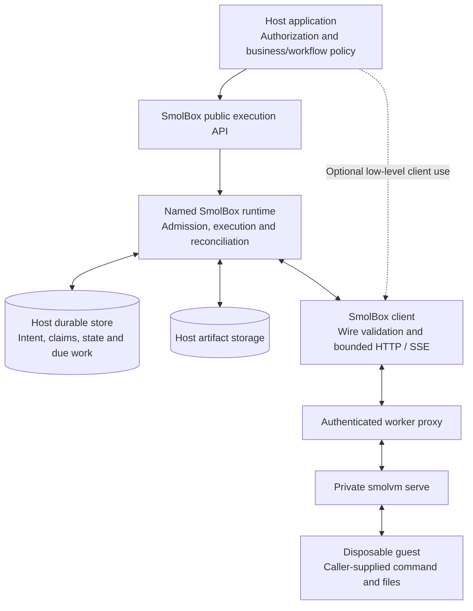
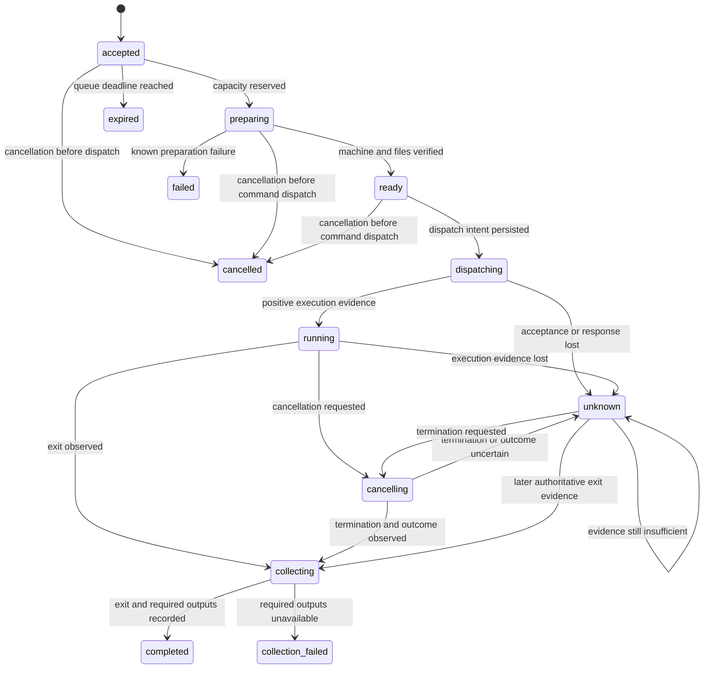

# SmolBox implementation plan

## 0.1.2 compatibility candidate (not released)

### Native macOS follow-up

Status: **scoped validation complete**, September 10, 2026. The maintainer separately
authorized ordinary native macOS 1.14.6 compatibility checks. Exhaustion and
adversarial tests remain restricted to the disposable Linux lab. No tag, release,
push or pull request is authorized by this follow-up.

- [x] Verify the official Darwin ARM64 archive, binary, agent, libkrun and the
  client OpenAPI subset; use a private worker home and database and preserve
  existing host services.
- [x] Boot and execute both approved ARM64 Python/Node artifacts, verify explicit
  UID execution and cleanup, and run the nine ordinary client/runtime cases.
- [x] Diagnose the initial file persistence failure without weakening the test.
  Without `resize2fs`, 1.14.6 lost a file after stop/start with 1/1 GiB requests;
  direct HTTP reproduced it, while 1.14.1 and matching 20/10 GiB requests retained
  the file. Supplying private e2fsprogs 1.47.4 made all nine cases pass unchanged.
- [x] Run all 16 PostgreSQL store and 25 durable recovery cases on the private
  macOS services. The current `mix ci` quality command also passes.
- [x] Run both examples normally and with cancellation, and the exact walkthrough.
  Fix the walkthrough to omit `unix_socket` when its environment variable is
  absent; passing `nil` previously failed TCP setup before any command dispatch.
  All eight analyzer canary pairs also pass.
- [x] Finish service recovery and fresh artifacts on the frozen candidate.
- [x] Freeze the updated candidate, validate its applicable complete gates and
  package consumers, and record final identity, results and owned-resource cleanup.

The accepted candidate is `9662e57c03940b155b356a41c20b20f002553341`.
It permits explicit macOS 1.14.6 and documents its host dependency. All four
Elixir/OTP lanes passed 199 deterministic and 23 tooling cases on each platform.
Quality gates and analyzer canaries passed, as did the exact-candidate live
matrix: nine ordinary macOS cases with both old and fresh artifacts, fourteen
Linux runtime cases, and sixteen store plus twenty-five durable cases on each
platform. Both hosts also passed three service scenarios, four example runs,
the walkthrough and a real database outage. All task runtimes were stopped;
existing services and the Linux recovery baseline were preserved.

Six package consumers used the same 89-file archive, SHA-256
`26bb1e99e2709e0fbb7f847258e568a1ca8c6e64c00ed6890e6067d44f87d9e1`.
The authenticated publishing dry run passed on macOS; nothing was published.
See the [final candidate report](release-candidates/0.1.2-macos.md) and
[exact-commit evidence](release-candidates/0.1.2-macos.json). These files and the
plan are excluded from package contents. The acceptance below remains the
earlier Linux checkpoint, including its then-outstanding authentication step.
The five adversarial runtime cases are not run or counted as passes on macOS.
Preparation identities, failures and results are preserved in
[`smolvm-1.14.6-macos.json`](evidence/smolvm-1.14.6-macos.json).

### Initial Linux checkpoint

The maintainer authorized preparing and validating this patch on September 10,
2026, explicitly excluding the real `v0.1.2` tag, Hex publication and GitHub
Release. All execution for this initial checkpoint ran on `ssh linux`. Existing 1.14.1 configuration
and its default remain compatible; 1.14.6 is an explicit Linux x86_64 option.
No new macOS or Linux ARM64 runtime qualification is claimed. Earlier macOS
1.14.1 evidence remains historical. Unsupported hard controls stay rejected.

- [x] Add exact, explicit 1.14.6 worker support without accepting version drift.
- [x] Capture official binary/agent/libkrun/OpenAPI identities and actual wire
  fixtures; validate old and newly prepared Python/Node artifacts and disk sizing.
- [x] Run the full Linux client/runtime, PostgreSQL, durable recovery, service
  fault and example suites for both supported runtime versions.
- [x] Repeat the constrained Linux resource/isolation campaign on 1.14.6,
  including kernel controls, startup refusals, exhaustion and external recovery.
- [x] Validate all four Linux Elixir/OTP lanes, coverage, all five analyzers and
  their canaries, audits, ExDoc and current/minimum package consumers.
- [x] Document explicit upgrade/drain procedures and measured boundaries,
  freeze an untagged candidate and record exact-commit acceptance and cleanup.

Preparation evidence is bundled in
[`smolvm-1.14.6-compatibility.json`](evidence/smolvm-1.14.6-compatibility.json).
Both worker versions passed 14 runtime, 16 store and 25 recovery cases. A second
1.14.6 runtime run passed with rebuilt Python/Node payloads, including explicit
guest UID selection and binary/streaming behavior. The ten workload probes,
eleven startup refusals, three durable outage cases and frozen outer-VM recovery
passed. The initial recovery failures and subsequent preparation-budget correction
remain recorded. All four Linux language lanes, five analyzers and canaries,
95.41% coverage, example analysis/audits and 42-page ExDoc link checks passed.
The final untagged candidate is
`279e7ce4d210e9ab8c256167a73df626fffefe25`. Its exact-commit matrix passed all
14 runtime, 16 store and 25 recovery cases, three service-failure scenarios,
four normal/cancellation examples and the walkthrough on each runtime version.
The rebuilt-artifact 1.14.6 suite passed another 14 cases and its disk-sizing
probe. All four language lanes passed 199 deterministic cases and 23 tooling
cases each; quality, canaries, audits, documentation and three fresh consumers
of the same 88-file archive passed. Final cleanup confirmed zero pending work
or reservations, no owned worker/VM processes, a clean rebuilt disposable disk,
the unchanged baseline and preserved physical-host services.

See the [0.1.2 candidate report](release-candidates/0.1.2.md) and
[exact-commit evidence](release-candidates/0.1.2.json). These repository-only
attestations are excluded from the tested package. Its SHA-256 is
`80d1fe6b124a2e4c234b2130249edfda5481bd5fa800f4ad1dbcbe19b204cc29`.
The candidate is accepted for this scoped Linux compatibility preparation;
general production security certification and new macOS qualification are not
claimed. The authenticated Hex publishing dry run remains outstanding: the
attempt stopped at missing authentication and is not counted as passed.
Authenticate and repeat it when the separate release step is authorized.

Local execution of the required CI commands supplies this preparation's evidence.
No GitHub run of the new commit is claimed without an authorized push. The existing
manual worker workflow remains optional. Versioned public documentation/source
links become available only after the separately authorized release.

## 0.1.1 documentation and validation release

Status: **published and verified**, September 8, 2026. The maintainer authorized publishing
0.1.1 with the revised operating guides and Linux qualification evidence. Library
source, public APIs, persisted records and production dependencies remain unchanged
from 0.1.0. New validation runs only on Linux, following the maintainer's explicit
host restriction. This patch therefore requires ordinary CI, the supported
Elixir/OTP lanes, existing bounded Linux runtime/recovery suites, documentation
checks and current/minimum consumers of the same final package. Earlier macOS
results remain historical evidence; no new macOS run is required or claimed for
this patch. This scoped decision does not rewrite first-release acceptance below.

Tag `v0.1.1` identifies tested commit `db0797c58b1209017641d759b6ff3a35a9f2e8a1`.
All 18 ordinary CI jobs passed, as did the four Linux compatibility lanes,
analyzers/canaries, 14 real runtime cases, 16 store cases, 25 durable recovery
cases, three service-fault scenarios, both examples and current/minimum consumers.
The public Hex archive and fresh registry consumer matched the validated 86-file
package. HexDocs and the GitHub Release were published and verified; cleanup
preserved existing host services. See the [0.1.1 release report](release-candidates/0.1.1.md)
and [machine-readable evidence](release-candidates/0.1.1.json). No required work
remains for this patch's scoped release. This attestation does not move its tag.

## 0.1.0 publication

Status: **0.1.0 published and verified**, September 7, 2026. Tag `v0.1.0` identifies
validated commit `21b3e92fa4feaa4d86d4ac6981ddacf50388d641`. The complete required final-commit matrix passed:
18 ordinary GitHub jobs, eight compatibility lanes with 186 deterministic cases
each, all analyzers/canaries, 95.40% coverage, documentation checks, real workers,
durable recovery, host examples, package consumers and owned-resource cleanup.

The maintainer explicitly authorized this publication after the earlier RC-only
work. [Hex](https://hex.pm/packages/smolbox/0.1.0) and
[HexDocs](https://hexdocs.pm/smolbox/0.1.0/) were published and verified before the
[GitHub Release](https://github.com/hfiguera/smolbox/releases/tag/v0.1.0).
The downloaded Hex tarball matches the validated 84-file archive, and fresh
macOS/Linux consumers successfully installed the documented Hex dependency.

See the [0.1.0 release report](release-candidates/0.1.0.md) and its
[machine-readable evidence](release-candidates/0.1.0.json). No required work remains
for this release under section 1.4. Production resource/isolation certification,
protected real-worker GitHub provisioning and independent consumer review remain
excluded; no production profile is certified. Historical RC evidence and tags
remain unchanged. This later repository-only attestation does not replace the
validated release commit.

## RC2 acceptance checkpoint

Status: **0.1.0-rc.2 accepted for the development-qualified first-release scope**,
September 7, 2026. Candidate `9ce713f8cc8b4e1b417473869b76a5dc7ad2dd8a`, tagged
`v0.1.0-rc.2`, passed the complete required matrix at that exact commit.

- Ordinary GitHub CI: all 18 jobs passed with zero skips.
- Eight Linux/macOS Elixir/OTP lanes: 186 deterministic cases each, including
  the pinned Elixir 1.20.4/OTP 29.0.6 pair on both platforms.
- Both canonical hosts: all five analyzers and eight bad/clean canary pairs,
  95.40% production-library coverage, 22 standalone tooling tests, dependency
  audits, zero dependency cycles, and warning-free ExDoc with 42-page link checks.
- Each host: 14 real client/runtime tests, 16 SQL store tests, 25 durable recovery
  tests, three worker-service fault scenarios, both normal/cancellation host
  examples, actual database-outage rejection and verified owned-resource cleanup.
- Four fresh current/minimum dependency consumers: the same verified 84-file
  archive, with every file matched to the candidate Git object. Version, changelog,
  MIT license/dependency declarations, source tag/links and Hex-name availability
  were reviewed.

The [RC2 attestation](release-candidates/0.1.0-rc.2.md) and its
[machine-readable evidence](release-candidates/0.1.0-rc.2.json) record the matrix
and the GitHub-discovered process-launch test race corrected before the final
freeze. RC1's tag and historical evidence remain intact. The later repository-only
attestation commit does not replace the tested candidate.

RC2 retains section 1.4's scope. Production resource/isolation certification,
protected real-worker GitHub infrastructure and independent consumer review remain
excluded; no production profile is certified. No required work remains for RC2
under that scope. No Hex package, GitHub Release or public service was published.

## Previous release and development checkpoints

Status: **0.1.0-rc.1 accepted for the revised first-release scope**, September 7, 2026.
Candidate `164c0c2c3f71109b4224c2f7f2c807a25e0cdebd`, tagged `v0.1.0-rc.1`, passed
the complete required matrix. The standalone library, durable host examples,
documentation, tests and CI configuration are implemented. Ordinary GitHub CI
passed all 17 jobs without skips. All six supported Linux/macOS toolchain lanes
passed 178 deterministic cases. Both canonical hosts passed every requested
analyzer and bad/clean canary, with 95.40% production-library coverage.

Each canonical host also passed 14 real client/runtime tests, 15 PostgreSQL store
tests, 25 durable recovery tests, three worker-service fault scenarios, both host
examples and actual database-outage checks. Four fresh current/minimum dependency
consumers used the same verified 80-file archive. Version, changelog, license,
source tag/links, package metadata and current Hex-name availability were reviewed.
See [the final candidate attestation](release-candidates/0.1.0-rc.1.md) and its
[bounded machine-readable evidence](release-candidates/0.1.0-rc.1.json).

The first release targets the tested client/controller contract with the existing
`:development` worker qualification. Production resource/isolation certification,
protected real-worker GitHub infrastructure and independent consumer review are
outside this release's scope; none is claimed complete or scheduled as follow-up.
Unsupported hard controls remain rejected. Local results establish development-host
behavior, not production isolation. No required work remains for this candidate
under section 1.4. No Hex package, GitHub Release or public service was published.

The candidate tag and archive remain tied to the tested commit. The later
repository-only attestation commit does not replace that candidate. Historical
checkpoints below retain their original results; Phase 9's final record supersedes
their then-pending release gates without changing the evidence.

Post-candidate boundary cleanup, September 7: execution validation, CI command
execution and the durable example now have one-way dependencies. The store adapter
coordinates record/index writes within the existing partition transaction. Public
APIs and persisted record formats are unchanged. Root and durable-example CI reject
static file-dependency cycles, with an isolated failing/passing canary.

Working-tree checks on macOS with Elixir 1.20.4/OTP 28.5 passed: 179 deterministic
cases, 95.40% library coverage, all five analyzers and all bad/clean canaries,
22 standalone tooling tests, warning-free ExDoc, and zero cycles in both projects.
The durable example passed 16 tests against an isolated PostgreSQL 17.10 instance,
including rollback of a machine assignment after a rejected execution write, plus
its forced Dialyzer check and database-outage rejection. The task-owned database
was stopped after verifying no test partitions, triggers or functions remained.
Current-dependency and minimum-dependency consumers
passed from the same new 80-file archive; the latter used Elixir 1.18.4/OTP 27.3.4.15.
These development checks do not qualify a new release commit. Before shipping these
changes, freeze a new candidate and repeat the complete required matrix, including
the existing Linux/macOS real-runtime suites. The original RC tag and attestation
continue to describe only candidate `164c0c2`.

Post-candidate documentation review, September 7: ExDoc now starts at the README,
groups guides and API modules by use, and omits developer Mix tasks from public
navigation. The new getting-started guide covers worker/artifact preparation,
supervision, input staging, duplicate submission, execution, output reading and
confirmed cleanup. Troubleshooting and constructor option references explain
failure outcomes and defaults. Evidence JSON files are copied into the generated
site; a new CI task checks local files and HTML fragments. These changes are
unreleased and do not move the accepted candidate tag or its source links.

On macOS with Elixir 1.20.4/OTP 28.5, `mix ci` passed 186 cases (4 doctests,
6 properties, 176 tests), all five analyzers, formatting, compilation and the
dependency-cycle check. The 14 separately tagged real-runtime cases were excluded
from that deterministic command, as intended. The 22 standalone CI-tool tests
also passed. ExDoc built with warnings treated as errors; all 42 generated HTML
pages passed the local-link check. Browser review verified the guide layout,
navigation and API search. Three regression tests prove that valid generated
links pass and missing files/fragments or an absent site fail.

The exact final walkthrough code block was extracted from the guide and run on
the existing native macOS SmolVM 1.14.1 worker, with Python artifact SHA-256
`d982cfdf0c59b862ad3e1b107446b127460f716c8407fd0e2b6b0de2a62fe18e`.
It returned the original handle on duplicate submission, printed the expected
message, collected `42\n`, and confirmed completed cleanup with no reservation.
The worker inventory was empty afterward and its original process was preserved.
Current and minimum production consumers passed from the same 82-file archive
with SHA-256 `03a9ac8eb86f9631e04f8389abadd48456449c7040179d2ef107a4558600ee33`;
the minimum consumer used Elixir 1.18.4/OTP 27.3.4.15. Both new guides are packaged.
At that documentation-review checkpoint, Elixir 1.20.4/OTP 29.0.6 was not yet
installed. The following toolchain validation supersedes that local limitation.
The documentation review did not rerun the complete Linux/macOS candidate matrix.

Post-candidate OTP 29 validation, September 7: installed Elixir 1.20.4 compiled
for OTP 29 and verified the running Erlang patch as 29.0.6 (ERTS 17.0.6). The
library, tests and tooling source remain identical to `de4f35f`; no library code
or dependency-lock changes were needed. Main CI checks and the optional live
workflows now select this pair, with distinct OTP 29 cache keys. Compatibility
jobs retain Elixir 1.18.4/OTP 27.3.4.15, Elixir 1.19.5/OTP 28.5, and
Elixir 1.20.4/OTP 28.5. The updated workflows pass Actionlint. At this checkpoint,
they had not run on GitHub and no Linux OTP 29 result was available; the Linux
follow-up below supplies that host's development evidence.

Local macOS validation passed all 186 deterministic cases (seed 626550), all five
analyzers, all eight bad/clean quality-canary pairs, 95.40% coverage (seed 919835),
and 22 standalone tooling tests. A dedicated PostgreSQL 17.10 instance passed all
16 store tests and all 25 real-worker restart-recovery cases. The separate real
client/runtime suite passed all 14 cases. The exact getting-started code block
also passed on this pair, with the original duplicate handle, expected stdout and
`42\n` file, complete collection/cleanup and no reservation. Both host examples
passed compilation and forced Dialyzer checks. Project warning gates remained
enabled; existing dependency warnings and OTP 29 Yamerl deprecation warnings were
visible. Root/example dependency audits passed after serializing their shared
advisory-checkout refreshes; failed parallel refresh output was not accepted.

After the real suites, the task database had zero execution and machine-identity
rows and no test triggers. The task-owned database was stopped and the actual
database-outage probe printed `database-unavailable-confirmed`. The original
SmolVM server remained running with an empty inventory. Source hashes, seeds and
bounded runtime reports are in [the OTP 29 macOS evidence](evidence/otp29-macos.json).
These development checks do not move or requalify the original RC tag.

ExDoc subsequently built with warnings treated as errors, and all 42 HTML pages
passed the local file/fragment check, including the new evidence asset. Fresh
production consumers with current and minimum direct dependencies both passed on
Elixir 1.20.4/OTP 29.0.6, using the same 83-file archive with SHA-256
`69e4289bff7dcc40637bd967192f5a14863fb3adcb41429727512381f47a14b1`.
The minimum-dependency check here tests dependency lower bounds on OTP 29; it is
not a new Elixir 1.18/OTP 27 run. The original release archive remains untouched.

Post-candidate Linux OTP 29 validation, September 7: installed the same Elixir
1.20.4/OTP 29.0.6 pair (ERTS 17.0.6) under the Linux qualification directory,
without changing the account's global toolchain. A clean, separate checkout of
`a480f8f40356c3fcd3d7cb82f65c83eb626a5c39` was used on Linux x86_64 with KVM.
Library, test, example and dependency-lock contents match the macOS source
commit `de4f35f`; no library or lock changes were needed.

Linux passed all 186 deterministic cases (seed 670350), all five analyzers,
eight bad/clean quality-canary pairs, 95.40% coverage (seed 398984), and 22
standalone tooling cases. A dedicated socket-only PostgreSQL 16.15 instance
passed 16 store tests and all 25 bounded real-worker restart-recovery cases.
All 14 separate real client/runtime cases passed. The exact getting-started
walkthrough passed, including duplicate-handle reuse, expected stdout and file
contents, complete collection/cleanup and released reservation. Both host examples
passed compilation and forced Dialyzer; root/example dependency audits passed.
An initial minimal-example Dialyzer attempt lost a consolidated BEAM file while
other Mix checks ran in that build directory. Repeating the same commands alone
passed without source changes; the evidence retains the initial failure digest.

ExDoc built with warnings treated as errors and all 42 HTML pages passed local
file/fragment checks. Fresh current/minimum-dependency production consumers both
passed on the Linux OTP 29 pair using one 83-file archive, SHA-256
`7485995c1e0aa3ac65db44375836fb70a3f16da01f9bfc61cfd21024ad11c50f`.
The database had zero execution/identity rows and no test triggers before the
task-owned instance was stopped; the actual outage probe passed. Original SmolVM
and shared PostgreSQL services were preserved, and worker inventory was empty.
[The Linux evidence](evidence/otp29-linux.json) records source hashes, seeds,
bounded reports, package consumers and cleanup. This supplies the previously
missing Linux OTP 29 validation; it does not claim a GitHub workflow run or
requalify the original RC tag.

After adding this Linux report, formatting and the ExDoc build/link checks passed
again locally. Fresh current/minimum-dependency consumers on macOS OTP 29 passed
from the updated 84-file archive, including the Linux evidence asset, SHA-256
`3130198936a76d669d906d71b564790a48634f23c0f0f49b461b22132ecb02f2`.
That documentation refresh is separate from the committed-source Linux archive
identified above.

The source repository is [hfiguera/smolbox](https://github.com/hfiguera/smolbox).
The `origin` remote, package metadata and ExDoc source links use this repository.
It remains private during implementation; public visibility is not a prerequisite
for completing the repository metadata. Candidate documentation links to the
verified `v0.1.0-rc.1` tag; source links resolve to the tested candidate for readers
with access to the private repository.

Implementation evidence lives in [compatibility.md](compatibility.md) and `docs/evidence/`. Checked items below mean the specific work has evidence; they do not waive the remaining phase exit conditions or release requirements.

Historical evidence files retain their original metadata and pending items;
earlier reports of a missing remote or source URL predate this repository setup.
The scope decision in section 1.4 supersedes their former release prerequisites
without changing any test result, missing evidence or unsupported guarantee.

This plan defines implementation work, verification requirements, and release gates for the `smolbox` Elixir library. The detailed design sections retain the original rationale and targets; the public client/host guides and generated API docs describe the implemented interfaces.

## 1. Outcome and scope

SmolBox should let an Elixir application submit an authorized command with files and resource constraints to a configured pool of self-hosted `smolvm serve` workers, observe the outcome, collect outputs, and reconcile interrupted operations without blindly executing the command again.

Ship an independently usable library with optional, explicitly started supervised components.

### 1.1 Required first-release capabilities

- A typed client for the verified subset of a pinned SmolVM local HTTP API.
- Local development through loopback or a protected Unix socket; remote worker access through authenticated TLS proxies.
- Machine creation, inspection, start, stop, and deletion within a library-owned namespace.
- Command execution with an argument vector, explicit environment, working directory, and deadline.
- Bounded stdout/stderr handling, streamed execution events, and explicit nonzero exit results.
- Staging and collection of approved files with size limits and digest verification.
- Asynchronous execution handles and inspection independent of the caller process.
- A small configured worker pool with health, capability checks, resource admission, and draining.
- Stable request identities, duplicate-submission handling, persisted state through a host store, and reconciliation after restart.
- Cancellation requests whose outcomes are confirmed by worker evidence, plus separately tracked cleanup.
- Telemetry and structured errors that omit secrets and uploaded code by default.
- Tests against controlled HTTP peers and real pinned SmolVM installations on Linux and macOS.
- Required CI gates for Dialyzer, Credo, ex_dna, ex_slop, and Credence, alongside compilation, formatting, tests, dependency audits, documentation, and packaging.

### 1.2 Explicit exclusions

Do not implement the following in this package:

- Python dependency resolution, JavaScript bundling, TypeScript compilation recipes, or language-specific function runners.
- Application-level retries, approvals, or compensation for external effects.
- A managed sandbox service, public worker API, billing, infrastructure provisioning, or autoscaling.
- An embedded SmolVM NIF or the managed Smol Machines cloud API.
- Arbitrary host mounts, guest access to host credentials, GPU/CUDA, interactive terminals, or persistent developer workspaces in the first release.
- Warm VM reuse, branching, checkpoints, or machine export as required first-release features. Add verified primitives later only for a concrete consumer.
- Exactly-once external execution or recovery of live guest processes after host loss.

The host supplies commands and interprets their results. SmolBox manages execution and cleanup.

### 1.3 Evidence required to call the first release usable

Two small host applications must demonstrate submission, files, results, cancellation, restart inspection, and cleanup. At least one must use a durable store. A simulated and a real interrupted execution must remain identified as the original operation; insufficient evidence must produce an explicit unknown outcome.

### 1.4 First-release scope decision (September 7)

The maintainer has removed these three workstreams from the first-release acceptance criteria:

- **Production resource and isolation qualification:** no new certification campaign
  for excessive memory/disk/processes/output, total server buffering, hard termination
  deadlines, hostile file races or comprehensive credential/control-endpoint isolation.
  Keep completed experiments, existing regression tests and their measured limits.
- **Protected real-worker GitHub infrastructure:** no required provisioning of
  disposable Linux/macOS runners, protected environments or independent CI worker
  teardown. Keep the manual workflow and local test tools available. Its existing
  infrastructure and strict pass requirements still apply if it is used.
- **Independent consumer review:** external integration feedback is welcome, but
  soliciting or obtaining it is not a release prerequisite. Supplied examples and
  automated fresh consumers are the planned adoption evidence.

These items are out of scope, not completed, and have no scheduled follow-up.
Adding any of them later requires a new scope decision. The library continues to
reject unsupported hard controls and makes no production isolation certification
claim. Capacity reservations are accounting; they do not establish host quotas.
Cancellation remains evidence-based, with unknown outcomes preserved.

Existing functional, fault-recovery, boundary, quality and package checks remain
required. Run the existing bounded Linux/macOS suites for the exact release commit
on the available development hosts and retain commit, toolchain, runtime/image
identities, results and cleanup evidence. Label these as local development-host
validation. No skipped suite or earlier-commit result substitutes for that run.

## 2. Starting point and verified dependencies

Treat `external-references/` as reference material, not package source; source inspection is encouraged, but do not modify, format, run SmolBox's quality analyzers over, or ship nested upstream repositories.

### 2.1 Upstream boundary

The selected project is `smol-machines/smolvm`, with its per-host `smolvm serve` API. Its documentation lists lifecycle, command execution, file transfer, and SSE operations. It also states that local API authentication and complete fleet management are outside that API's guarantees. [Local API](https://smolmachines.com/docs/local/local-api-smolvm-serve), [self-hosting](https://smolmachines.com/docs/local/self-hosting).

Use SmolVM `v1.14.1` as the first compatibility-spike candidate, not as an already certified runtime. That release was visible during this review. Record the exact runtime version, source commit, binary checksum, host architecture, guest image digests, and generated OpenAPI checksum before accepting it. [Candidate release](https://github.com/smol-machines/smolvm/releases/tag/v1.14.1).

Source inspection of that tag confirms camelCase exec fields, including `timeoutSecs`, and an argument-vector command. Its buffered response includes byte-preserving base64 output alongside lossy text. This evidence should inform fixtures; it does not establish cancellation, output bounds, or durable execution receipts. [API types](https://github.com/smol-machines/smolvm/blob/v1.14.1/src/api/types.rs), [execution handlers](https://github.com/smol-machines/smolvm/blob/v1.14.1/src/api/handlers/exec.rs).

#### Local upstream source checkout

A local SmolVM source checkout is available at `external-references/smolvm`. Use this checkout when implementation work needs direct inspection of upstream API types, handlers, tests, or runtime behavior. The containing `external-references/` directory is ignored by Git.

Before relying on local source as compatibility evidence, record its commit and working-tree status and compare it with the selected release; do not assume the checkout matches `v1.14.1`. Inspect pinned source with read-only Git commands when needed, preserving the user's checkout. Source inspection informs the contract, but real-runtime tests must still verify operational guarantees.

This checkout is a local development reference, not a SmolBox dependency or a required CI input. CI and other contributors must obtain the explicitly pinned upstream version independently; do not require a maintainer-specific checkout path in implementation, tests, or workflows.

### 2.2 Elixir and OTP policy

- Proposed minimum: Elixir 1.18, since the reviewed ex_dna and ex_slop releases require `~> 1.18`.
- Canonical development/quality lane: Elixir 1.20.4 with OTP 29.0.6, matching `.tool-versions`.
- Compatibility lanes: Elixir 1.18.4 / OTP 27.3.4.15, Elixir 1.19.5 / OTP 28.5, and Elixir 1.20.4 / OTP 28.5.
- OTP 29 results must identify the tested host; adding the pair to CI does not establish an unexecuted Linux or macOS result.
- Pin exact patches in the repository's tool-version file and CI. The combinations above are the intended matrix, not permission to use floating versions indefinitely.
- Do not claim support for untested combinations or for every future Elixir minor merely because a dependency requirement permits installation.

The official compatibility table supports those version pairings. Recheck it when pinning or expanding the matrix. [Elixir/OTP compatibility](https://hexdocs.pm/elixir/compatibility-and-deprecations.html#between-elixir-and-erlang-otp).

### 2.3 Dependency decisions

| Dependency | Intended use | Boundary |
|---|---|---|
| Req, initially evaluate stable 0.7.4 | HTTP requests and controlled response streaming | Private transport implementation; no global Req defaults |
| Jason | JSON wire encoding and decoding | Explicitly declare direct use; never turn remote keys into atoms |
| telemetry | Execution, transport, capacity, and cleanup events | No exporter dependency in the library |
| NimbleOptions, if it materially simplifies config validation | Trusted host configuration | Request structs still require explicit validation |
| ExUnit and StreamData | Unit, property, and concurrency tests | Development/test only |
| Req.Test and a local HTTP test server | Deterministic client behavior and real stream fragmentation | Tests must exercise the actual transport boundary too |
| Dialyxir, Credo, ex_dna, ex_slop, Credence | Required quality checks | Development/test only; details in section 12 |
| ExDoc and mix_audit | Docs and dependency security checks | Development/test only |

Database and artifact-storage integrations belong in host adapters. Supply extension points only where this plan needs them. Req supports streaming but also has automatic request behavior that must be configured deliberately. [Req](https://hexdocs.pm/req/Req.html), [Req retry behavior](https://hexdocs.pm/req/Req.Steps.html#retry/1).

## 3. Package structure and deployment

Maintain SmolBox as a standalone Mix project at its repository root. The packaged library must compile and run in a fresh external consumer.

Target structure; create files as their phases require them:

```text
smolbox/
  .github/workflows/
    smolbox-ci.yml
    smolbox-live.yml
    smolbox-runtime-qualification.yml
  .gitattributes
  .gitignore
  mix.exs
  mix.lock
  .formatter.exs
  .credo.exs
  .ex_dna.exs
  README.md
  CHANGELOG.md
  LICENSE
  lib/
    smolbox.ex
    smolbox/
      client.ex
      client/{machines,exec,files}.ex
      transport.ex
      transport/req.ex
      wire/{encode,decode,sse}.ex
      error.ex
      worker.ex
      capabilities.ex
      command.ex
      execution_spec.ex
      execution.ex
      result.ex
      profile.ex
      files.ex
      runtime.ex
      runtime/{coordinator,admission,executor,reconciler,cleanup}.ex
      store.ex
      store/memory.ex
      artifact_store.ex
      telemetry.ex
  dev/mix/tasks/
    smolbox.ci.credence.ex
    smolbox.ci.verify_checks.ex
  test/
    unit/
    contract/
    runtime/
    integration/
    support/
    fixtures/{wire,openapi,quality}/
  scripts/ci/
  examples/
    minimal_host/
    durable_host/
  docs/
    implementation-plan.md
    compatibility.md
    security.md
    recovery.md
    host-integration.md
```

The actual workflow YAML belongs at the repository root, for example `.github/workflows/smolbox-ci.yml`; library commands run from the SmolBox repository root and host-example commands run from their respective `examples/` directories. Package internals above are an initial map, not a reason to create empty modules or one-line wrappers.



The worker proxy and SmolVM installation are operator-managed dependencies. SmolBox provides their deployment contract and integration tests; it does not implement a new generic proxy service. A basic authenticated proxy must not be described as supplying durable execution receipts or request deduplication.

## 4. Public API and data contracts

### 4.1 Two explicit API levels

The low-level client exposes verified machine, file, and command operations. It is useful without a scheduler, but it does not promise durable execution or safe replay of commands.

The managed API adds persisted intent, admission, identity, reconciliation, and cleanup. Use it when work must outlive a request process.

Proposed signatures:

| API | Contract |
|---|---|
| `SmolBox.child_spec(options)` | Start an explicitly named, host-supervised runtime |
| `SmolBox.submit(runtime, spec)` | Return `{:ok, handle}` only after the store accepts the request; otherwise a typed error |
| `SmolBox.fetch(runtime, scope, execution_id)` | Return an authoritative stored snapshot within that scope |
| `SmolBox.await(runtime, handle, timeout)` | Wait for an observed result; observer timeout does not cancel work |
| `SmolBox.cancel(runtime, scope, execution_id, options)` | Persist cancellation intent; acknowledgment does not mean termination |
| `SmolBox.reconcile(runtime, scope, execution_id)` | Request inspection of existing work, never a command replay |
| `SmolBox.drain_worker(runtime, worker_id)` | Stop new admission while observing existing work |
| `SmolBox.Client.*` | Typed low-level operations with documented weaker guarantees |

Do not expose arbitrary remote URLs or arbitrary machine names through the managed API. Host code chooses the configured worker pool and profile. A scope is a trusted host namespace, not proof of end-user authorization.

### 4.2 Execution specification

Define an immutable `ExecutionSpec` containing:

- Caller-supplied execution ID or idempotency key, scoped to the runtime/host namespace.
- Pinned runtime image or verified prepared-artifact reference and target architecture.
- Command argument vector, optional stdin bytes under a cap, approved environment entries, and guest working directory.
- Input-file manifest: approved source reference, destination, size, digest, and access mode.
- Declared output paths, per-file and aggregate collection bounds, and destination references.
- Host-selected profile and its immutable policy identity.
- Queue expiry, execution deadline, and cleanup/evidence retention policy.
- Correlation metadata limited to approved scalar fields; no opaque dumped application state.

Build a canonical specification fingerprint. Include every field that changes execution meaning. Redact or securely key hashes involving low-entropy secret values; do not expose a public digest that enables guessing credentials. A duplicate key with an identical fingerprint returns the existing handle. A duplicate key with a different fingerprint fails with an identity-conflict error.

For the first release, allow only host-approved runtime artifacts, one managed command per disposable machine, and no detached/background mode. Multiple staging operations are internal preparation, not independently retryable user commands. Reject unknown options, duplicate environment names, invalid paths, invalid UTF-8 where the upstream field requires text, and unsupported binary stdin explicitly.

Approved runtime images must start with a verified neutral entry point. Machine start, image initialization, restart policies, and reconnection must not invoke the caller's command before the persisted dispatch boundary or automatically repeat it. Disable automatic workload restart in managed mode. Include image entry-point behavior in the Phase 0 contract tests.

### 4.3 Results, errors, and events

Keep three dimensions separate:

| Dimension | Example values |
|---|---|
| Execution evidence | `not_dispatched`, `dispatch_uncertain`, `running_observed`, `exited`, `termination_confirmed`, `unknown` |
| Collection status | `pending`, `complete`, `partial`, `failed` |
| Cleanup status | `pending`, `in_progress`, `complete`, `failed` |

A result includes exit code when known, bounded stdout/stderr or stored output references, byte counts/truncation indicators, declared artifacts, timings, worker/machine identity, and observed evidence. Do not equate exit code zero with valid function JSON or business success; the caller's lifecycle module owns that interpretation.

Use a structured error with a finite category, operation, execution identity, safe message, dispatch-evidence classification, and optional redacted upstream details. Categories should distinguish validation, unsupported capability, authentication, admission exhaustion, queue expiry, transport failure, protocol failure, nonzero command exit, output limit, unknown outcome, and cleanup failure.

Progress notifications are advisory. Consumers recover by fetching a snapshot; mailbox delivery is not durable history. Do not provide an unbounded per-subscriber log stream. The first release can offer bounded callbacks plus cursor-based inspection; a richer subscription interface requires explicit backpressure and disconnect semantics.

## 5. Profiles, isolation, and file safety

### 5.1 Threat and trust boundary

Treat commands, guest output, files, image contents, and dependency-installation code as untrusted. The Elixir host, durable store, proxy configuration, SmolVM host account, VMM, host OS, and hypervisor are trusted infrastructure. Guest root must not be trusted to attest that execution happened only once or to enforce host safety limits.

The managed API accepts policy selected by trusted application code. It must not merge caller-supplied Smolfile settings, host mounts, proxy credentials, or arbitrary endpoint overrides into a worker request.

Default to no guest network access, no host mounts, no port forwarding, no SSH-agent forwarding, no host sockets, and no GPU features. The library must not broaden these capabilities because an image pull or a command failed.

### 5.2 Capability matrix before implementation claims

Create `docs/compatibility.md` with one row per control, pinned runtime, host OS, and architecture:

| Control | Required evidence | Reject or qualify when unavailable |
|---|---|---|
| CPU allocation | Correct vCPU configuration and admission reservation | A vCPU count is not a CPU-time quota |
| Guest memory | Runtime configuration plus overload experiment | Record host overhead; guest memory alone is not a full host RSS bound |
| Wall-clock deadline | Verified process-tree/VM termination behavior | HTTP timeout alone cannot satisfy it |
| Disk | Guest storage bounds and host sparse-file/cache accounting | Requested disk size alone does not prove host exhaustion protection |
| Process limit | Enforced guest/host mechanism under hostile code | Do not rely on a user-editable function runner or guest root cooperation |
| Output | Streaming limits plus bounded upstream behavior | Limiting BEAM buffering does not prove the server buffers safely |
| Egress denial | Tests for guest traffic, host/control-plane access, and image preparation | Do not silently enable networking |
| Allowed egress, later | Actual DNS/CIDR behavior including redirect and private-address cases | A hostname list is not a complete isolation proof |
| Concurrency | Atomic admission across the supported controller topology | A local semaphore cannot enforce a cluster-wide quota |
| Cancellation | Observable termination and separately known command outcome | Stopping observation is not cancellation |

This matrix describes the evidence needed before advertising each guarantee; it
is not a requirement to implement or certify every row in the first release.
The existing `:development` qualification exposes measured guest allocations and
controller accounting. If a requested hard control cannot be enforced, reject
that profile before dispatch. Record whether a control protects the guest, the
worker host, or only the controller. A certified production profile is outside
the first-release scope under section 1.4.

### 5.3 Staging and collection rules

- Resolve artifact references through trusted host integration; do not fetch arbitrary guest-provided URLs.
- Stream to private staging locations with bounded size, verify the digest, and publish a completed staged file atomically where the chosen transport supports it.
- Normalize guest paths, reject traversal/NUL/ambiguous encodings, and keep output selection within the approved workspace.
- Treat symlinks and archive members as untrusted. Do not unpack guest-controlled archives directly into host paths; first-release file transfer can avoid archive extraction entirely.
- Use exact declared output paths initially; defer recursive wildcard collection until its traversal and resource bounds are proven.
- Define handling of missing files, changing files, partial transfer, digest mismatch, duplicate names, and excessive aggregate output.
- Host artifact-store credentials never enter the guest. Optional future guest credentials need a separate explicit policy; no inheritance from host environment.
- Preserve binary data using verified binary-safe wire fields or file download. Do not silently substitute lossy text output for byte-exact output.

Observed staging correction: the pinned packed Python artifacts follow a
`/workspace` symlink to a file elsewhere inside the guest on download. Linux and
macOS both reproduce this. The API restricts output selection lexically, but
cannot promise canonical workspace containment or race-free symlink rejection.
Do not substitute an untrusted guest precheck for a descriptor-level upstream
boundary. Profiles requiring that stronger guarantee remain unsupported. File
uploads replace the tested symlink without changing its former target; FIFO
reads can block before upstream's type check and require an independent client
deadline plus owned-VM termination. See `docs/security.md` for the measured
scope and unqualified boundaries.
- Include artifact staging and collection in the overall deadline and capacity accounting. Retain enough disk accounting for failed cleanup and unknown outcomes.

## 6. Persistence, state transitions, and recovery

### 6.1 Store boundary

Define a `SmolBox.Store` behaviour whose contract includes atomic insert-if-absent, lookup, versioned state transition, bounded due-work queries, execution claims, admission reservations, and cleanup scheduling. Specify transactions/CAS semantics and error behavior before choosing module callback names.

Provide:

1. An in-memory adapter for tests and explicitly ephemeral local use. Its documentation must state that a VM/application restart loses records and may leave worker machines behind.
2. A durable host example implementing the contract with Ecto/Postgres, its own Repo and migrations, outside the published core dependency tree.
3. A reusable adapter conformance suite covering duplicate keys, conflicting fingerprints, compare-and-swap races, restart reads, claims, and due-work recovery.

Managed durable mode requires a store that declares and passes the required semantics. Do not silently fall back to memory. Persistence failure before acceptance prevents dispatch. Persistence failure after possible dispatch causes reconciliation work and conservative uncertainty, not a new execution.

The core library does not start a database or run host migrations. The durable example is required evidence and integration guidance, not a promise that an arbitrary callback adapter is safe.

### 6.2 Persisted record

Store at least the schema version, namespace, execution ID, fingerprint, immutable spec/artifact references, worker ID, machine name, admission reservation, controller claim/fencing generation, state/version, stage timestamps, cancellation intent, dispatch intent/evidence, observed exit, result references, collection status, cleanup status, next reconciliation time, and redacted error history.

Do not serialize PIDs, open sockets, process references, closures, or arbitrary host modules as durable job state. Credential references can be resolved at dispatch; secret values require an explicit secure host storage policy if persistence is necessary.

Persist worker and machine identity before creation. Generate bounded opaque machine names with a host-controlled ownership namespace; never derive a raw machine name from end-user text. Persist mappings sufficient to verify ownership on later cleanup. A matching name alone is not proof of ownership after conflicts or manual replacement.

### 6.3 State machine



This is the normal execution projection. Cleanup is a separate persisted state machine and can still be pending after completion, failure, cancellation, or uncertainty. A completed command may have a nonzero exit code. An unknown execution may be confirmed stopped without recovering its original exit code; represent both facts rather than forcing a successful/failed result.

### 6.4 The dispatch uncertainty rule

There is an unavoidable gap between writing dispatch intent and receiving worker evidence. Persisting intent before HTTP does not make the worker command idempotent.

After the request may have been sent:

- Disable automatic command retries in the HTTP stack, proxy, queue consumer, and execution process restart path.
- Inspect the existing machine and any trustworthy execution record. Machine existence, guest-written files, an SSE reconnect, or a PID alone may be insufficient evidence.
- Do not resend `exec` simply because no running process can be found; it may already have completed.
- If no durable host-side receipt exists, preserve `unknown`. Document that this API path cannot recover every command result after a connection loss.
- A host workflow may later authorize a distinct retry attempt based on its own idempotency/business policy. SmolBox never invents that authorization.

Phase 0 must determine whether the pinned worker API exposes durable, queryable execution identity and deduplication. If it does not, the initial release uses the conservative unknown-outcome contract. Automatic recovery of a precise outcome requires a separately reviewed worker-side receipt capability; adding a guest wrapper or an ordinary TLS proxy is not sufficient. A future receipt adapter must still handle the gap between receipt persistence and process spawn honestly.

### 6.5 Concurrency and ownership

- Atomic store acceptance prevents two controllers from accepting conflicting specifications under one ID.
- Claims and reservations coordinate controllers but cannot retract an HTTP request already in flight.
- Prefer one active controller owner per configured worker in the initial deployment model. Multi-controller takeover must not replay dispatched work.
- A stale controller must fail its next state write after losing its fencing generation. Require a fresh claim immediately before dispatch and conservative treatment of any race after it.
- Count unresolved executions and unconfirmed cleanup against capacity until evidence permits release. Expose an operator reconciliation path; do not silently overbook.
- On restart, scan bounded batches of due records and rebuild observation tasks. Registry entries and process mailboxes are caches, not authority.

### 6.6 Retry and cleanup table

| Operation | Retry policy |
|---|---|
| Read-only inspection | Bounded retries with jitter within the observation deadline |
| Machine create | Inspect the persisted name and ownership after ambiguity; do not create a replacement blindly |
| File upload before command dispatch | Retry only under verified overwrite/atomicity semantics and the same digest |
| Execute command | Never retry automatically after possible acceptance |
| Read/download declared outputs | Retry only during authorized collection on a running owned machine; the pinned endpoint can auto-start a stopped VM, so never use it as a liveness probe or after confirmed termination |
| Stop/delete | Reconcile owned machine state; verified absence can complete cleanup |
| Persist result / notify caller | Reuse the same execution identity; persist before sending advisory notifications |

Cleanup needs persisted due times, bounded retries, alerts after exhaustion, and an ownership-aware orphan sweep. Delete only verified owned resources. Do not discard an unknown operation's remaining evidence merely to make the queue appear clean; apply a documented retention policy and record any evidence loss.

## 7. Transport and wire implementation

### 7.1 Endpoint inventory

Capture the installed release's `smolvm serve openapi` output and a minimal, attributed set of fixtures. Build the client against this selected subset:

| Operation | Documented local API path | Initial use |
|---|---|---|
| Create/list/inspect machines | `/api/v1/machines` and `/api/v1/machines/:name` | Required |
| Start/stop/delete | Machine lifecycle paths | Required |
| Buffered command execution | `/api/v1/machines/:name/exec` | Small bounded cases only after server bounds are measured |
| Streamed command execution | `/api/v1/machines/:name/exec/stream` | Preferred for observable command output |
| Upload/download files | `/api/v1/machines/:name/files/*path` | Required, within verified transfer limits |
| Machine logs | `/api/v1/machines/:name/logs` | Diagnostic use; not proof of a particular command result |
| Image preparation | Verified image/preparation paths | Host-controlled setup; not implicit guest permission expansion |

Do not implement every route because it exists upstream. Live-memory features, pools, cloud rollouts, and unrelated upstream services are outside this package's initial contract.

### 7.2 HTTP behavior

- Configure a client instance per worker configuration; never mutate global HTTP defaults.
- Use TLS peer verification and configured CA/mTLS or proxy token authentication for remote workers. Restrict plain HTTP to explicitly configured local development endpoints.
- Disable redirects and automatic retries for mutating requests; no credential forwarding to a redirect target.
- Bound connect, pool checkout, response idle, request body, response body, and overall operation time separately.
- Encode request fields centrally and reject unknown host options before dispatch. Keep all untrusted JSON keys as strings at the wire boundary.
- Validate status, content type, required fields, sizes, numeric ranges, and error payloads. Unknown additive response fields may be ignored deliberately; missing safety-critical fields fail.
- Never log authorization headers, environment values, stdin, source files, or complete remote error bodies by default.
- Test Unix-socket support in the actual Req/Finch transport version. If that path is unavailable, report it and use configured loopback for development; do not pretend socket support was verified.

### 7.3 SSE and backpressure

Implement a small protocol-focused parser, not a generic event bus. Test split UTF-8 sequences, partial lines, CRLF, multi-line data, comments/keepalives, unknown event types, invalid JSON, oversized events, duplicate exit events, EOF without exit, and chunks arriving after termination.

Wire event decoding follows the pinned source and fixtures. Preserve stdout/stderr ordering within each stream; do not invent a total order if the runtime cannot provide it. Distinguish transport completion from a command exit event.

Read in bounded chunks. Use controlled consumers or bounded spool files rather than sending unbounded chunks into a GenServer mailbox. Define what happens when output storage or a subscriber is slow: stop optional live delivery, preserve bounded capture, and request termination if a hard output limit is exceeded. Disconnecting the SSE request alone must not be treated as stopping the guest.

## 8. OTP runtime and pool management

Use explicit host supervision:

```text
Host supervisor
  SmolBox runtime supervisor (one named instance)
    scoped Registry
    HTTP connection pool
    admission/coordinator process
    DynamicSupervisor for execution observers
    Task.Supervisor for bounded I/O work
    reconciler
    cleanup scheduler
```

The final tree can be smaller if responsibilities compose cleanly. Do not use a GenServer merely as an in-memory map. Avoid blocking the coordinator on long HTTP calls or guest work. Execution-process restarts resume observation from persisted state; they do not rerun the original command.

Configuration includes stable worker IDs, proxy endpoint/auth references, runtime version/capabilities, OS/architecture, supported image/profile references, CPU/memory/disk reservations, concurrency limits, and drain state. Keep caller metadata separate from worker configuration.

Admission chooses an eligible healthy worker using a simple deterministic policy such as available capacity with stable tie-breaking. Bound the pending queue, implement explicit overload/expiry results, reserve host overhead, and release resources only under the persisted outcome/cleanup rules. First-release fairness can be a bounded FIFO within host-assigned pools; cross-tenant priority algorithms are later work.

Health distinguishes reachable, degraded, draining, and unavailable. HTTP reachability alone does not establish image availability, hypervisor readiness, or free execution capacity. Refresh capabilities after upgrades and reject incompatible work. Drain prevents new submissions to a worker while keeping observation and cleanup available.

Runtime shutdown stops admission, persists due work, and allows a bounded observation drain. Whether a workload continues or is explicitly terminated follows its host-selected policy; killing the Elixir process must not be presented as confirmed cancellation.

Persist absolute deadlines for restart recovery and use monotonic elapsed time within a process. Specify queue, preparation, execution, collection, and cleanup budgets separately. Convert to the runtime's timeout units deliberately, without rounding into an unbounded request. If the controller restarts after a deadline, reconcile and request termination where appropriate; do not reset the workload's allowed time.

## 9. Telemetry and operator information

Provide documented telemetry for admission, preparation, dispatch, observed exit, unknown outcome, collection, cancellation, cleanup, and worker health changes. Separate queue wait, runtime preparation, code execution, collection, and cleanup durations.

Metrics must use bounded labels such as event kind, platform, and outcome category. Execution IDs belong in structured events/traces, not high-cardinality metric labels. Payloads exclude secrets, input values, code, and stdout/stderr unless the host explicitly opts into a separate protected sink.

Inspection must expose last known stage, evidence quality, version compatibility, cancellation intent, next reconciliation time, output availability, and cleanup state. Document which actions are observational, which terminate an owned guest, and which require a new host-authorized execution.

## 10. Test strategy

### 10.1 Deterministic suite: required on every relevant PR

| Area | Required scenarios |
|---|---|
| Encoding | Exact field names, omitted defaults, invalid fields, path escaping, environment limits |
| Decoding | Nonzero exit, malformed body, base64 bytes, oversized payload, unknown additive fields |
| Transport | Auth failure, redirect rejection, timeout, disconnect before/after possible acceptance, no POST replay |
| Streaming | Every SSE boundary case in section 7.3; bounded slow-consumer behavior |
| Identity | Identical duplicate returns same handle; conflicting spec fails; two concurrent submitters |
| State | Valid/invalid transitions, cancellation races, stale state writes, expiry before dispatch |
| Store | Restart reads, claim conflicts, atomic reservations, pagination of due work, unavailable database |
| Files | Digest mismatch, traversal, symlinks, binary files, missing outputs, changing outputs, collection caps |
| Cleanup | Failed stop/delete, already absent owned machine, foreign machine protection, orphan discovery |
| Isolation configuration | No implicit network/mount/socket/credential capability; unsupported profile fails early |
| Telemetry | Correct events, bounded metadata, redaction, slow or crashing observers |

Use a controllable clock and deterministic failure injection. Avoid tests that merely restate field assignments. Property tests should explore state transitions, ID conflict semantics, path normalization, and arbitrary chunk boundaries.

### 10.2 Real-runtime suites

For the first release, run the existing bounded suites on the available Linux and
macOS development hosts with pinned binaries/images, dedicated test workspaces,
verified resource ownership and cleanup. Retain exact candidate evidence:

1. Linux x86_64 with working KVM: Python and JS scripts, file round trip, stdout/stderr, nonzero exit, timeout, cancellation, no-network test, collection, deletion.
2. macOS arm64 with verified virtualization support: the same supported contract, including artifact architecture checks.
3. Add Linux arm64 only when a runner exists and the suite passes; do not infer it from macOS arm64.
4. Store-backed restart tests: terminate the Elixir controller at each dispatch/collection/cleanup boundary and reconnect through a fresh host process.
5. Worker restart and transport fault tests: lost response, restarted `smolvm serve`, missing guest, inaccessible host, and unavailable output storage.

The completed finite output, path, deadline and resource probes remain in the
test/evidence record. Expanding into a production resource-abuse or isolation
campaign is outside this release. Such experiments would require independently
enforced host bounds; the scope change does not authorize disruptive tests on
shared hosts.

Python and JS scripts are execution fixtures supplied by the tests. Do not turn these fixtures into a SmolBox function-runner SDK or add TypeScript build recipes to the package.

Real-runtime test selection must fail when explicitly requested but the runtime or virtualization capability is absent. A skipped real-runtime suite cannot qualify a platform for release.

#### Available Linux test host

The user has provided a Linux machine for SmolBox testing, accessible from the development machine with:

```sh
ssh linux
```

Use this host for the Linux compatibility spike and real-runtime integration tests. Access is authorized for that testing; the SSH alias does not establish its architecture, KVM availability, installed tooling, or readiness. Before the first run, verify the host architecture, kernel, `/dev/kvm` access, available CPU/memory/disk capacity, and installed SmolVM and Elixir/OTP versions. Match the pinned runtime and guest images to the verified architecture.

Use a dedicated test workspace and per-run resource names, preserve unrelated host workloads, and collect bounded test reports with the exact SmolBox commit and runtime/image versions. Apply the isolation requirements above before disruptive or resource-abuse tests. Record the verified setup and repeatable commands in `docs/compatibility.md` during implementation.

The `linux` alias is a local SSH configuration, not an automatically available CI runner. Keep the remote destination configurable in test tooling. Local runs can provide first-release integration evidence. If the optional GitHub runtime workflow is enabled later, its CI access and runner isolation must be configured separately under section 12.7.

### 10.3 Fault injection matrix

Inject controller failure immediately before/after: store acceptance, admission reservation, machine creation, file upload, dispatch-intent write, HTTP exec send, first output, exit event, artifact persistence, result write, stop, delete, and notification.

For each boundary assert the execution ID, number of actual commands observed by the controlled worker, resulting evidence state, capacity accounting, and eventual cleanup. The accepted outcome can be `unknown`; a second uncontrolled command is never the expected recovery behavior.

## 11. Implementation phases and reviewable increments

Complete phases in dependency order. Each phase should be a focused PR or a small series of PRs with its stated evidence. Do not mark a phase complete because only a mock path works when its exit condition requires a real worker.

### Phase 0 — Verify the worker contract and hard feasibility questions

Dependencies: none.

- [x] Select the SmolVM release candidate and exact Elixir/OTP/tool pins.
- [x] Inspect the local upstream checkout described in section 2.1, record its commit and working-tree status, and tie source-derived contract decisions to the selected release.
- [x] Capture its OpenAPI schema, checksums, and minimal request/response/event fixtures. Attributed schema, lifecycle, buffered exec, and SSE fixtures are saved under `test/fixtures`.
- [x] Connect with `ssh linux` and complete the Linux host preflight in section 10.2; record the architecture, virtualization access, tool versions, and dedicated test workspace.
- [x] Run one manually controlled Python command and file round trip on Linux and macOS.
- [x] Verify how a prepared runtime runs with guest egress disabled.
- [x] Verify neutral image entry points and disabled restart policies keep caller commands behind the dispatch boundary. Real-library tests stage/execute once, stop/start, and verify the test marker remains single; source fixtures force `/bin/true` and `never`. Guest markers are test instrumentation, not production execution receipts.
- [x] Record the existing finite timeout, stream-disconnect, cancellation and binary-output checks, including known server-buffering limits. Phases 6 and 8 record the passing cases and uncertainty rules; this does not establish total server-memory bounds or hard termination deadlines.
- [x] Determine whether durable exec receipts/deduplication exist; record the conservative recovery contract if absent. No such identity or receipt is exposed by the selected exec API; preserve uncertainty.
- [x] Record measured allocations/accounting and explicitly unsupported process and host-disk controls in the capability matrix. This is a record of the current development contract, not a certified production profile.
- [x] Record proxy/account isolation requirements and platform limitations. `docs/security.md` documents trusted accounts, private control interfaces, authenticated TLS, finite proxy queues, disabled mutation retries, artifact approval, platform-specific controls and unfenced requests. Documentation does not certify hostile-host/resource isolation.

The broader buffering, hard-resource and isolation qualification previously
included in this phase is outside the first release under section 1.4.

Deliverables: compatibility/security notes and attributed wire fixtures. Exit: the development-qualified client/controller contract has real evidence and clearly bounded claims; unresolved hard controls are explicitly unsupported rather than guessed.

### Phase 1 — Scaffold the standalone package and make CI fail correctly

Dependencies: initial Phase 0 version decisions.

- [x] Create `mix.exs`, explicit package metadata, source URL, runtime dependencies, development tools, formatter, and documentation setup. The project source URL and Hex GitHub link point to `https://github.com/hfiguera/smolbox`; candidate ExDoc source links target `v0.1.0-rc.1`. The private repository is configured as `origin`.
- [x] Use environment-specific compilation paths so `dev/mix/tasks` is excluded from production consumers.
- [x] Commit the maintainer lockfile and exact toolchain pins; do not rely on the lockfile to constrain downstream Hex consumers.
- [x] Implement the Credence CI wrapper and quality-check canaries described in section 12.
- [x] Add root-level GitHub workflows and the local `mix ci` entry point. `SmolBox CI` covers deterministic/quality/compatibility/security/docs/package checks and the durable store on push, pull request or manual dispatch. The optional manual-only `SmolBox Runtime Qualification` workflow requires candidate preparation and protected Linux/macOS live jobs when dispatched. Each workflow has a fixed dependency-result gate rejecting missing, failed, cancelled and skipped checks. Ordinary jobs have executed on GitHub. Provisioning and running protected real-worker CI are outside the first-release scope; local real-runtime evidence remains required.
- [x] Require every requested analyzer; verify intentional bad fixtures produce a failing process. Compiler, all five analyzers, and coverage have verified clean/bad counterparts.
- [x] Configure packaging exclusions for references, nested repositories, credentials, caches, VM state, and CI-only code. A fresh production consumer compiled from the scaffold tarball without quality tools. Phase 9 subsequently verified public API/supervisor smoke checks in all four final-candidate consumers.

Exit: an intentionally introduced compiler warning, Credo/ex_slop issue, duplicate, Credence issue, or Dialyzer violation fails its gate. Clean scaffold passes; no live workers are contacted by routine CI.

Initial repository metadata checkpoint (September 7, before the candidate freeze):
formatting and ExDoc with warnings treated as errors passed. At that checkpoint,
all 168 generated source links targeted `main`, with file paths and line numbers
checked against the local source. The built Hex archive contained the GitHub and
upstream links; its 80 allowed files passed the canonical
macOS fresh production-consumer checks, including warning-as-error compilation,
client/supervisor smoke checks and runtime-only dependencies. That checkpoint
verified the initial metadata update without changing repository visibility or
publishing the package. Phase 9 subsequently verified all 168 candidate source
links against `v0.1.0-rc.1` and confirmed the remote tag resolves to the tested commit.

Maintainer-tool migration (September 7): all eleven Python scripts and test files
have been removed. `elixir scripts/ci.exs` dispatches the required-status gate,
package-consumer check, live preflight, bounded runner and worker-service fault
scenarios. Shared implementation lives under `dev/smolbox/ci/`; production and
Hex consumers exclude it. The bootstrap uses Elixir/OTP without fetching Mix
dependencies. Host probes also use standard Unix process tools and `curl`, with
user configuration, proxies, redirects and mutation retries disabled.

The obsolete changed-path classifier and full-history checkout are gone.
At this migration milestone, `smolbox-ci-tools` recorded the checked-out commit
and ran the tooling regressions; the aggregate gate read the manual qualification
selection. The subsequent workflow separation below moves candidate recording
to the runtime workflow and removes the skip exception from ordinary CI. The old
Phase 0 probe's unique assertions now live in the fourteen real Elixir runtime
cases, including Python timeout/network/streaming, JavaScript binary nonzero
output, file round trips and observed allocations.

Verification: 22 standalone ExUnit regressions pass on canonical and minimum
toolchains on both hosts. The canonical full suite passes 178 cases on each
host; macOS production-library coverage is 95.40%. All five analyzers pass on
both hosts and their bad/clean canaries have executed successfully. Formatter,
dependency-lock checks, security audits, ExDoc and Actionlint pass. The new
runner has executed all fourteen live client/runtime cases and all three
worker-service fault scenarios on both platforms. Each service scenario retains
one dispatch attempt, unknown outcome evidence and verified owned-VM cleanup.

The initial concurrent durable runs failed because macOS forwards the same
Linux PostgreSQL instance, whose unchanged connection limit is 20. The macOS
diagnostic rerun passed all 25 cases (seed 441647, 281.4 seconds); its actual
output also passes the new summary validator. A subsequent isolated Linux run
passed all 25 through the new bounded runner (seed 457043, 287.0 seconds).
The CI guide now requires sequential local runs when sharing this database;
protected CI jobs require dedicated instances. Both normal workers have empty
inventories after testing; no unrelated services or upstream checkout were changed.
One stopped VM retained by the failed Linux run was matched to its encrypted
execution record and full creation evidence before deletion. Reconciliation then
released its reservation, with the dispatch ledger still containing one attempt.

The final 80-file archive has SHA-256
`c207c9e54727bf0dae6341a981ef30ad624a300c83b460739575c8e41f44b1e5`.
That identical archive passes fresh current and minimum dependency consumers on
both hosts, with package-file hashes matching the maintained source. Runtime,
consumer, initial failed-run and final preflight evidence is retained locally in
`/tmp/smolbox-elixir-evidence-BMHcY4`. Its `source-manifest-final.json` records the
tooling source and removed files, with SHA-256
`69253d737df276067b498effebb6a2c6b86146512aca2cac98c4aa79159bdda1`.
The macOS diagnostic log remains private; it is not an uploaded CI artifact.
These records describe the working tree based on `7c97895`, not an exact-release
commit or an executed GitHub run of the migrated workflows.

The port includes regression checks for an exited leader with a TERM-ignoring
descendant, unrelated-process preservation, bounded output and phase queues,
exclusive report creation, rejected incomplete suites, private manifest files,
spoofed macOS argv names, HTTP redirects/error-body overflow, user curl config,
and malformed package members/gzip. The first macOS executable probe exposed
that `ps comm` can reflect spoofed argv; the replacement requires exactly one
mapped text file matching the kernel short name, followed by the pinned digest.
A consumer fixture initially triggered an ExUnit unmatched-file warning; it is
now an explicitly loaded `.exs.template`, and the warning-as-error suite passes.
These development-host results do not provision or certify protected CI workers
or establish a production resource profile. Both workstreams are outside the
first-release scope under section 1.4.

Live-CI milestone: 16 policy/preflight/bounded-runner regressions pass on both
hosts, including deliberate zero/partial/skipped suites, overflow, deadlines and
surviving child-process cleanup. Actionlint accepts both workflows. The bounded
runner executes all nine real client/runtime cases and all 25 durable cases on
each host; restart, prolonged-unavailability and missing-VM scenarios also pass
on each. Real development preflight verifies the current worker binaries,
wrappers, prepared artifacts and private listeners. These runs preserve one
dispatch attempt and unknown outcomes through verified owned-resource cleanup.
See `docs/evidence/phase1-live-ci.json` for counts, seeds, hashes and limitations.
The repository now has a configured remote. In the first
[GitHub CI run](https://github.com/hfiguera/smolbox/actions/runs/34138037540)
at `17fabbaf30281d11303a2980042d7b0f975e43f5`, all 16 ordinary jobs passed.
The aggregate failed under the previous policy because both real-worker jobs
were skipped. That run does not validate the later opt-in policy or this metadata
change. Protected real-worker execution and independent ephemeral worker teardown
remain unverified and are now outside the first-release scope.

Workflow separation (September 7): the ordinary
[GitHub run at `2a403f5`](https://github.com/hfiguera/smolbox/actions/runs/34145090794)
passed all 17 regular jobs, including the aggregate, all five analyzers and their
canaries. Its canonical suite passed 178 cases with 95.40% coverage. Its two
runtime jobs were intentionally skipped under the earlier opt-in policy.
Commit `0051fff` removes those jobs and their input from `smolbox-ci.yml` and
moves candidate preparation and both platforms into the manual-only
`smolbox-runtime-qualification.yml`, reusing `smolbox-live.yml` unchanged.
Disabled infrastructure fails candidate preparation before scheduling workers.
The ordinary and runtime aggregates each require their own exact job set to
succeed, with no allowed skips. At this milestone, both successful workflows on
the same exact commit were release requirements. Section 1.4 now permits recorded
local runs for the existing real-runtime suites and makes GitHub runtime
qualification optional. The prior green run does not verify this separation.

Local validation of this separation: all 22 standalone tooling regressions pass
on macOS with canonical Elixir 1.20.4/OTP 28.5 and minimum Elixir 1.18.4/OTP
27.3.4.15. Canonical `mix ci` passes 178 cases (seed 930801, 76.8 seconds), format,
unused-lock checks, warning-as-error compilation and all five analyzers. Actionlint
accepts all three workflow files. Parsed workflow checks verify triggers, exact
dependency sets against both Elixir gates, aggregate command selection and shared
candidate wiring. Executing the actual infrastructure-guard shell step rejects
unset/false enablement and accepts true. These checks contact no live workers.

The subsequent [GitHub run at `0051fff`](https://github.com/hfiguera/smolbox/actions/runs/34146296618)
passes all 17 ordinary jobs with zero skipped jobs, confirming the ordinary
workflow separation. It supplies no protected real-worker evidence and predates
the current documentation scope revision.

### Phase 2 — Model contracts, validation, and wire codecs

Dependencies: Phases 0–1.

Current increment: `Command`, `Worker`, `MachineSpec`, `Files`, `Result`, and
`Wire.SSE` have validation and property tests, including captured upstream
responses. Worker configuration rejects unsafe endpoints, and machine starts
remain separate from user-command dispatch. Keyed execution-spec fingerprints
and namespaced machine identities are now implemented with immutable profiles and
bounded file manifests. The HTTP client and endpoint response integration follow
in Phase 3; no production profile certification follows from these fixtures.

- [x] Implement public types, finite errors, configuration parsing, command/spec validation, and canonical fingerprints. HMAC-SHA256 covers all semantic fields, including policy, manifests, deadlines, and metadata.
- [x] Implement worker namespacing and profile-to-wire conversion using only supported fields. Names are opaque; namespace matching alone never authorizes cleanup. Unsupported hard controls fail early.
- [x] Add endpoint codecs, binary handling, path handling, and SSE parser. List responses use the actual `machines` envelope. Lifecycle POSTs send `{}` because the upstream optional JSON extractor rejects an empty JSON body.
- [x] Property-test normalization, fingerprint stability, and stream boundaries. Canonical macOS lane: 33 passing cases (5 properties, 28 examples), 100% current library line coverage, all five analyzers pass.
- [x] Document low-level versus managed guarantees. Public module docs distinguish weak machine evidence, keyed identity, guest allocations, upstream-default file permissions, and host-store responsibilities.

Exit: invalid or unsupported work is rejected before transport; codecs pass real captured fixtures and malformed-input tests.

### Phase 3 — Low-level client and safe transport

Dependencies: Phase 2.

- [x] Implement lifecycle, file, and exec calls with explicit auth, TLS, retries, redirects, and timeouts.
- [x] Add controlled HTTP server tests for stream failures and request replay counting.
- [x] Verify loopback and Unix-socket behavior, and remote proxy authentication.
- [x] Bound controller buffering and expose byte-preserving results where supported.
- [x] Run a disposable real machine through create/start/exec/files/stop/delete.

Evidence: 48 deterministic cases pass on canonical macOS/Linux and the two compatibility lanes. Five opt-in real-library cases pass on each initial platform, including live TLS proxy forwarding. Both worker inventories are empty after cleanup. Source hashes and remaining qualification gaps are recorded in `docs/evidence/phase3-client.json`.

Exit: supported client operations work on the pinned worker; POST exec is never retried by hidden transport defaults.

### Phase 4 — Store contract, identity, and durable host example

Dependencies: Phase 2; can proceed alongside Phase 3 after interfaces settle.

- [x] Implement the store behaviour, memory adapter, versioned records, and conformance suite. Memory conformance, bounded admission, claim/worker fencing, immutable evidence, safe record encoding, and fresh-BEAM codec loading pass. This is not durable-database evidence.
- [x] Implement a minimal host-owned Ecto/Postgres adapter and migrations under `examples/durable_host`. Schema 1 uses transactional partition locks, indexed due queries, and authenticated encrypted records.
- [x] Test atomic acceptance, conflicting duplicate specs, claim races, reservations, and due-work queries. Ten real PostgreSQL tests pass, including the shared concurrent conformance scenarios, rollback, corruption, and a fresh BEAM read.
- [x] Define migration/version compatibility and credential-reference handling. The example documents host-owned schema/key migration, strict version rejection, worker credentials outside records, and persistent secret storage.
- [x] Fail durable startup when persistence semantics are absent. Managed startup rejects ephemeral mode masquerading as durable, unavailable storage, and missing callbacks. The real Postgres adapter starts in durable mode and exposes the original accepted identity; no database migrations or memory fallback occur in core.

Exit: a fresh BEAM process can inspect accepted records and due work through the durable example; memory mode is visibly ephemeral.

Current Phase 4 evidence: 68 deterministic cases (6 properties, 62 examples) pass on canonical macOS/Linux, with all five analyzers and their clean/bad canaries passing on both hosts. Ten additional tests pass against real PostgreSQL 16.15 on Linux; the database was actually stopped for the unavailable-store probe and successfully restarted afterward. The adapter has its own passing Dialyzer and dependency audits. Root formatting/Credo/Credence and ExDNA now include maintained example code without scanning example dependencies or builds. CI contains a required disposable PostgreSQL job; this is locally verified workflow configuration, not a claimed GitHub Actions run. See `docs/evidence/phase4-durable.json` and the example README.

### Phase 5 — Managed execution and asynchronous handles

Dependencies: Phases 3–4.

- [x] Start the named runtime with host supervision and bounded task concurrency.
- [x] Implement acceptance, single-worker admission, preparation, dispatch intent, observation, result persistence, and inspection.
- [x] Implement observer timeout separately from execution deadline.
- [x] Connect file staging/collection through a minimal host artifact-store behaviour; supply a local example and a fake store.
- [x] Keep JSON function-result interpretation outside the core.
- [x] Demonstrate one prepared Python script and one prepared JS script through the managed API.

Evidence: the runtime and local directory artifact adapter are documented in `docs/host-integration.md`; controlled HTTP tests exercise caller exit, duplicate identity, collection failure, cancellation, observer restart, lost creation response, foreign-machine protection, queue bounds, and cleanup exhaustion. Real managed Python/JS collection and VM cancellation pass on both initial platforms. Library-only coverage is 94.30% across 86 deterministic cases. The full controller-boundary fault matrix and independent host applications remain Phase 6/8 work; these initial tests do not substitute for them.

Necessary contract corrections found during implementation:

- Due scans must retain records whose cleanup is complete but whose capacity release did not commit. Both store adapters now test this boundary.
- Concurrent request timestamps can arrive out of order. Claims/cancellation keep `updated_at_ms` nondecreasing; CAS still rejects stale versions. Observer monotonic time bounds elapsed stages separately from persisted wall timestamps.
- Unknown-outcome disks wait until the execution deadline plus evidence retention before deletion. Their fixed cleanup deadline includes this intentional wait plus the cleanup budget; it is not reset on restart. Whole-VM stop is attempted before that wait.
- After cleanup mutation retries are exhausted, only bounded read-only inspection continues. Observing operator-resolved absence can still release the original reservation.

Exit: a caller can disconnect and later retrieve the same execution; a nonzero exit and collection failure remain distinguishable.

### Phase 6 — Recovery, cancellation, and cleanup

Dependencies: Phase 5.

Current work: 35 controlled interruption boundaries plus two delayed-request
scenarios pass. The delayed-original-exec scenario also passes against real
Linux and macOS workers through a bounded test proxy. Canonical suites now pass
123 deterministic cases, with 94.70% library coverage and all five analyzers.
See `docs/evidence/phase6-controller-faults.json`. They cover store acceptance/reservation, HTTP creation/upload/exec,
first output/exit, artifact and result persistence, completion, stop/delete,
absence recording and capacity release. Fresh-controller recovery never sends a
second command. A subsequent durable-host increment passes 18 real PostgreSQL-backed
SIGKILL/restart boundaries on each platform (36 total), including dispatch intent,
first output, result/artifact persistence, stop/delete, absence and release.
Unknown cases wait through the actual one-minute example retention window;
known results survive interruption. See `docs/evidence/phase6-durable-recovery.json`.
Bounded orphan discovery is implemented and qualified without adopting or deleting
untracked resources. Actual API-server SIGKILL/restart now passes with a real
PostgreSQL-backed controller on both platforms. The VM survives server loss;
the original identity/deadline and unknown result survive recovery, with one
dispatch attempt and verified retention-window cleanup. See
`docs/evidence/phase6-worker-restart.json`. Additional real probes now cover
worker unavailability beyond the persisted cleanup deadline, operator-confirmed
VM disappearance, actual output-directory unavailability, and cancellation
immediately before/after SQL result persistence. All pass on both platforms;
see `docs/evidence/phase6-service-faults.json`.

The delayed-request probes required stricter behavior than the initial Phase 5
increment: a 404 during ambiguous creation cannot release capacity, and retained
unknown VMs require periodic observation after stop because an already-sent exec
can arrive later and auto-start the VM. Source inspection of `exec.rs` and
`state.rs` at the pinned tag confirms that lifecycle locks do not provide durable
request fencing. Current termination evidence can be revoked after a running VM
is reobserved. Strong cancellation/deadline guarantees remain uncertified.


- [x] Qualify persisted cancellation intent, evidence-based termination, and cancellation/completion race handling. Controlled and real SQL result-commit races preserve the observed exit and original cancellation timestamp across runtime restart. Real outages retain intent and reservations beyond the cleanup deadline; verified operator deletion allows later absence-based release.
- [x] Implement bounded reconciliation and cleanup scans on startup and periodically. Bounded task slots, paginated due scans, persisted retry counts/deadlines, and owner claims are implemented; full fault qualification remains below.
- [x] Qualify no-replay and accounting through the selected fault matrix. Controlled interruption boundaries, 36 real durable-host process-kill cases, API-server restart, prolonged unavailability and missing-VM cases on both platforms pass without a second dispatch. This is not a request-fencing or exactly-once certification.
- [x] Protect foreign resources during cleanup; implement orphan detection within verified ownership boundaries. `audit_worker/3` reports bounded read-only pages; names never authorize adoption or deletion. Worker/name assignment indexes are atomic and survive cleanup in both stores. Real tests leave untracked candidates untouched on Linux/macOS; controlled tests cover changed creation evidence, incomplete/slow stores and cleanup races.
- [x] Exercise the controller fault matrix and selected real service faults. Actual worker outages, missing VMs and filesystem output-store unavailability now supplement controller/result/artifact interruption evidence. Public telemetry/notification fault tests belong to Phase 8, where that interface is introduced; the current internal first-output notification already has interruption coverage. Moving that not-yet-existing public interface's checks avoids treating its absence as a tested notification implementation.

Exit: restarts do not duplicate commands; unresolved execution and cleanup are inspectable; cleanup failures cannot rewrite successful command results.

### Phase 7 — Configured worker pool, profiles, and draining

Dependencies: Phase 6.

- [x] Add health/version and readiness selection, bounded queueing, expiry, and explicit overload results. Typed `/health` plus the actual empty `/readyz` response drive admission; cached observations expire, and fresh checks precede reservation and command dispatch. Missing inventory, failed readiness, version drift, second-worker selection and queue expiry have controlled coverage. Real endpoints pass on both platforms, including authenticated TLS proxy access.
- [x] Reserve CPU/memory/disk/concurrency under the store's supported ownership model. Both adapters atomically charge slots, CPUs, guest memory plus host overhead, and requested disk allocations. Required operator-declared allocation floors prevent requests below the actual template sizes and VMM allowance; supplied templates require 20/10 GiB and the tested Linux VMM adds 768 MiB. Real cancellation tests verify the reservation prevents another assignment while the first outcome remains unknown. These are configured accounting bounds, not certified hard host limits.
- [x] Implement drain and incompatible-worker behavior without disabling inspection. Drain closes subsequent admission-task launches; already active admission/observation/cleanup may finish. The runtime-local convenience call is not an atomic worker-side fence; hosts persist intended `draining: true` configuration. Real and controlled tests verify post-drain queue expiry and retained inspection access.
- [x] Document limits of controller ownership and reject unsupported configuration. Stable physical-worker identity and one store authority are required; exact endpoint aliases, unknown options and unsupported qualifications are rejected. Leases fence store writes only. Active-active command fencing, DNS/proxy alias discovery and hard atomic drain are not claimed.

Exit: fresh admission excludes a degraded/incompatible worker; draining excludes
new admission-task launches while allowing already active work to finish. Unknown
executions retain appropriate capacity reservations. Hard minimal-profile
certification is outside the first release under section 1.4; the worker
configuration remains explicitly `:development`, with unsupported hard controls
rejected. Removing certification as a gate does not change enforcement behavior.

Current health increment: 138 deterministic cases and all five analyzers pass on
canonical macOS/Linux; library coverage is 95.18%. All nine real client/runtime
cases and all 21 durable-host VM cases pass on both platforms. Separate final
client and managed reruns include authenticated health/readiness, drain and
retained-capacity assertions. See `docs/evidence/phase7-worker-health.json`.

A subsequent policy check rejects allocation replies that differ from the
request and revalidates current artifact/profile approval for recovered prepared
work. Mismatched creation replies remain unverified with their reservation;
revoked approval never authorizes a command. See
`docs/evidence/phase7-allocation-policy.json` for the checks and real managed runs.

Resource correction from real qualification: SmolVM 1.14.1 copies disk templates
without shrinking them. Both platforms returned `storageGb: 1` while the guest
exposed a roughly 20 GiB filesystem; Linux also had 20/10 GiB raw disks. The
required worker `allocation_floor` now makes this dependency explicit, rejects
undersized new work, and rechecks recovered prepared work before dispatch.
Profiles/decoders allow up to 64 GiB per requested disk so the actual released
templates can be represented. This expands an arbitrary initial 8 GiB validation
ceiling; it does not add a hard filesystem quota. No persisted specification is
rewritten. Examples use a new immutable profile revision and reserve 30 GiB disk
plus 768 MiB VMM overhead per VM. Shared caches/logs/layers remain separate host
responsibilities. See [resource qualification](resource-qualification.md).

### Phase 8 — Telemetry, docs, examples, and security validation

Dependencies: Phases 5–7.

- [x] Add documented redacted telemetry and operator inspection fields. Bounded asynchronous delivery, finite metadata, stage durations, persisted cancellation timestamps, worker status/capacity and ephemeral drop/timeout counters are implemented. Controlled saturation/handler failures and real fresh-BEAM notification boundaries pass. See `docs/telemetry.md` and `docs/evidence/phase8-telemetry.json`.
- [x] Finish the minimal and durable host examples. Both standalone Mix projects compile, pass Dialyzer/audits, and demonstrate real Python execution, binary collection, cancellation and retention-window cleanup on Linux and macOS. The durable host also passes fresh-BEAM fault recovery; examples explicitly use a development profile.
- [x] Document deployment, artifact preparation, unknown-outcome handling, cancellation, cleanup, and upgrades. Packaged client/host/recovery/security/telemetry guides describe the external services and operator procedures, including pinned upstream preparation flags, template floors, durable keys, migrations, drain limits and immutable revisions. They distinguish completed tests from unqualified production resource/isolation guarantees.
- [x] Record measured image-cache availability, preparation, queue, execution, collection and cleanup without equating VM boot time with total function latency. The twenty-sample durable workload passes on both hosts, including bounded queue rejection, delayed consumers, preparation failure and uncertain-cancellation accounting. A separate fresh private Linux worker now records one verified image-cache miss followed by nineteen cache-hit samples. macOS uses per-machine extraction, with no equivalent shared-extraction hit path. These are already-running-host measurements; one cold-cache sample does not establish a percentile or SLA, and pristine-host startup is not claimed.

The remaining adversarial resource/output, file-boundary, credential and
control-endpoint campaign is outside the first release under section 1.4.
Completed finite probes and all existing regression cases remain required.

Exit: examples and guides provide reproducible setup, failure-state interpretation
and required service contracts, checked through the supplied examples and
automated consumers. An independent developer review is not required or claimed.

Telemetry milestone evidence: canonical macOS and Linux each pass 156
deterministic cases (6 properties and 150 tests) and all five analyzers. Coverage
is 95.40%. Both platforms pass nine live client/runtime cases and 25 durable-host
cases, including 20 fresh-BEAM interruption boundaries and dispatcher failure
before/after SQL result persistence. Execution counts, binary artifacts, stored
identity, reservations and verified cleanup are checked independently of delivery.
The first live Linux run exposed a fixture that reused an internal ETS handle as
public configuration; it now retains its original options and both full live
suites pass. Slow handlers and dispatcher failure do not run inside execution
tasks; notifications are still lossy, and repeated supervisor failures or hostile
BEAM handlers are outside this isolation guarantee.

The telemetry package also passes a fresh canonical production consumer and the
same tarball's minimum-dependency consumers on Elixir 1.18.4/OTP 27.3.4.15 on both
hosts. Documentation passes warnings-as-errors. These are milestone checks, not
the final release-commit matrix. They do not certify hard host resources or
comprehensive isolation; later finite measurements retain their stated limits.

Deployment-guide validation: pinned 1.14.1 CLI help/source confirms the documented
pack/serve options. ExDoc passes warnings-as-errors and a fresh canonical macOS
production consumer compiles the 72-file package including `docs/security.md`.
The tested archive SHA-256 is
`b3ac361b708183440587a8d8f434bf39ba573016422aab0ba2c7bee21aae4d09`;
the retained local consumer report SHA-256 is
`61b3e20ef3682158f1555e4b1220f701c9152d451bca52be284399ede574c4f7`.
The repository source URL is now configured; no independent deployment/consumer
review has occurred or is required for the first release. Documentation describes
obligations and limitations; it does not certify untested security properties.

Finite boundary milestone: the full real client/runtime suite now has 14 cases
and passes on both hosts. Five added cases verify output overflow with accurate
exit evidence, client/server file caps, observed packed-image symlink behavior,
blocked callback expiry, three selected control endpoints and FIFO read expiry.
The server-cap assertion inspects a bounded response and requires its specific
byte-cap diagnostic; an unrelated HTTP failure is insufficient. All owned VMs
are removed with creation-evidence checks and both inventories are empty. Strict
Credo/ExSlop, ExDNA (68 files, zero clones), Credence, Dialyzer, ExDoc and Actionlint
pass. See `docs/evidence/phase8-boundaries.json` for source hashes, test seeds and
the initially rejected fixture namespace. The live CI gate requires all 14 cases.
These finite probes do not certify quota-controlled resource-abuse resistance,
all credential/control-interface boundaries or a production profile. They also
provide no cold-cache performance evidence.

Warm-state benchmark milestone: the durable example now includes an opt-in,
bounded metrics collector and 100 ms resource sampler. Each full trial runs
20 sequential submissions, a one-slot/four-pending burst with four rejected
offers, a finite 512 KiB producer with a delayed caller, a preparation failure
and uncertain cancellation. All 28 accepted executions per host reach verified
cleanup with zero remaining reservations; successful example commands also
verify their binary output and one-byte guest marker. Invocation records precede
transport calls, so a killed observer cannot hide a possible dispatch merely
because its completed duration is missing. These remain client measurements,
not worker acceptance receipts.

At the benchmark milestone, the complete local `mix ci` passed on macOS and Linux:
156 deterministic cases,
all five analyzers, and a separately repeated clean/bad canary pair for the
compiler, each analyzer and coverage. ExDNA analyzed 71 files and Credence
122, including the benchmark. Both durable examples passed forced Dialyzer checks.
ExDoc passed. Source hashes, raw-report checksums, every sequential sample and
measured limitations are recorded in `docs/evidence/phase8-benchmarks.json`;
`docs/resource-qualification.md` explains the results. No cache was cleared and
the Mac/Linux hardware and database paths differ. These measurements do not
establish cold-state behavior, a hard profile or protected GitHub execution.
The final release-candidate matrix was still pending at this benchmark checkpoint;
Phase 9 records its subsequent completion under the revised scope.

The benchmark milestone's fresh canonical macOS production consumer also passes
from the built tarball, including warning-free compilation and public
client/supervisor smoke checks. Runtime dependencies exclude the benchmark,
examples and analyzer tools. The tested archive SHA-256 is
`9df83dfea5e89aa6603201e44cfc0c55c2574099af8f75f0098df6ecb14e543a`;
the retained consumer-report SHA-256 is
`64a3ddeacfbdd0e58b4272537ead5ced23cfbe01715a000c1af75d31a8698b7d`.

The complete current deterministic suite also passes all six advertised
host/toolchain lanes: Elixir 1.18.4/OTP 27.3.4.15, 1.19.5/OTP 28.5 and
1.20.4/OTP 28.5 on Linux and macOS. Each executes six properties and 150 ordinary
tests; fourteen runtime exclusions are not counted as live evidence. A cold
Linux run exposed an acceptance-timing assumption in the HTTP deadline fixture.
Its correction passes targeted tests and the full matrix without changing
production behavior. Both canonical `mix ci` runs pass every analyzer.
`docs/evidence/phase8-compatibility.json` records the source identities, initial
failure, corrected results and remaining limits. `docs/compatibility.md` now
separates current results from its historical milestone counts. This is a
compatibility milestone, not the exact final release-commit matrix.

Two independently bounded Linux experiments now add a real host-disk-full
boundary and finite slow-reader behavior. Private namespace workers had verified
2 GiB/no-swap/200%-CPU/128-task parent limits and 512 MiB tmpfs data mounts.
The disk producer received `EIO` at 336,592,896 guest bytes when the host mount
filled. Stop succeeded, but SmolVM could not commit deletion because its database
was also full. The retained owned unit/mount was explicitly torn down after
identity verification; this is not counted as successful API cleanup. A separate
64 MiB-upper-bound producer with a blocked callback expired observation after
3,003 ms, preserved uncertainty and then passed owned-VM stop/delete. Both units
and private mounts are gone, and the normal worker remains healthy and empty.

`docs/evidence/phase8-linux-containment.json` records kernel counters, source and
report hashes, settings, limitations and the failed delete. These experiments
also show why 128 host tasks do not enforce a guest process-count limit. The
namespace setup disables per-VM UID dropping/shared extraction and logs a
ten-second failed systemd scope adoption, so its timings are not the normal
cold-start benchmark. No minimal production profile is certified. A
production storage design must preserve control metadata capacity and qualify
recovery when exhausted storage prevents the worker API from cleaning up.
Equivalent independently bounded macOS experiments, broader isolation and
protected real-worker GitHub execution are unverified and outside this release.

A finite macOS guest-memory experiment now complements the Linux guest OOM
result. In a neutral 256 MiB VM, a child attempted at most 384 MiB, exited with
signal 9, and the guest kernel OOM counter advanced from zero to one while its
log identified an OOM-killed Python process. The parent and VM survived;
ownership-checked stop/delete and empty inventory passed. An initial direct
PID-match fixture failed because it compared different observed PID domains;
that attempt and its successful cleanup remain in
`docs/evidence/phase8-macos-memory.json`. No host quota or broader macOS
production-isolation claim follows from this finite guest experiment.

Cache-state measurement is now recorded in `docs/evidence/phase8-cache-state.json`.
A new private Linux worker had no extracted image cache before its first request.
The first outcome/cleanup took 2.171/2.477 seconds; the following nineteen cached
samples had outcome median/p95 1.956/2.184 seconds and cleanup median/p95
2.220/3.413 seconds. Create took 218.895 ms for the miss versus cached median
17.263 ms. One miss is a single observation, not a cold-cache distribution. All
28 accepted executions across benchmark phases cleaned up and released capacity;
the verified owned worker unit was stopped. Four benchmark source hashes match
the previously verified implementation. The initial missing object-directory
setup failure occurred before submission and is preserved.

Measurement clarification: earlier progress notes grouped an image-cache miss
and a cold OS host together. They are separate conditions. The plan's reference
workload now distinguishes empty/cached extraction on an already-running Linux
host, while macOS 1.14.1 has only the per-machine packed-extraction path tested
by its twenty-sample workload. No OS cache clearing, host reboot, fabricated
macOS cache-hit path or cold-host performance claim is needed to report these
results. The bounded reference measurement item is complete for those explicit
conditions; they make no production resource/isolation certification claim.

### Phase 9 — Release candidate and adoption evidence

Dependencies: the in-scope earlier exit conditions and ordinary section 12 gates,
applying the exclusions in section 1.4.

- [x] Run ordinary GitHub CI, the full supported Elixir/OTP compatibility matrix and the existing bounded real-runtime suites on the exact release commit. Local Linux/macOS runs with recorded identities/results/cleanup satisfy real-runtime verification; the optional protected GitHub workflow is not required.
- [x] Build the Hex tarball, inspect its file list, and compile/test a fresh consumer from the extracted package. The repeatable package-consumer harness passes current and minimum runtime dependencies, fake-transport decoding, and explicit supervision without contacting a worker. All four consumers were repeated against the final candidate archive; see the attestation below.
- [x] Verify production consumption excludes CI tools and example-only dependencies. Fresh `MIX_ENV=prod` consumers resolve only runtime dependencies, inspect package members/compiled modules, and compile extracted SmolBox itself with warnings as errors.
- [x] Confirm package name availability, license, source metadata, changelog, semantic version, and supported capability claims.
- [x] Record successful use by the two supplied host examples and automated fresh package consumers. Phases 8 and 9 retain the milestone results; both examples and all four consumers also passed on the exact release candidate. No independent consumer review is required or claimed.
- [x] Keep publication separate from implementation and ordinary CI. The original implementation and RC validation published no package. The maintainer subsequently authorized 0.1.0 publication after successful final-commit validation; the release report records its completed Hex/HexDocs and GitHub publication. Ordinary CI does not publish packages or deploy services.

#### Historical metadata and package checkpoints

Pre-release metadata review is recorded in `docs/evidence/phase9-readiness.json`.
At that checkpoint, the package was `0.1.0-dev` with MIT metadata and the reviewed standard
license text. Its changelog now describes the complete implemented API and
measured limitations. The official Hex package API returned 404 for `smolbox`
on September 7, 2026; that observation neither reserves the name nor establishes
publishing permission. Declared licenses/notices from the nine resolved runtime
dependencies are recorded; dependency/upstream source is not bundled. Repository
metadata is now configured as recorded in Phase 1. Protected runner provisioning,
independent review and remaining production resource/isolation qualification are
outside the first release under section 1.4.
No metadata review is counted as release-candidate acceptance.

The updated 79-file package archive now passes fresh production consumers on
canonical Elixir 1.20.4/OTP 28.5 and minimum Elixir 1.18.4/OTP 27.3.4.15 on **both**
Linux and macOS. All four consume the identical tarball:
`226211fb1b52114bad62300a9e5d7d2dee6b4a37c8bbe18c7899bb22dbb3e433`.
Its public client/supervisor smoke checks and extracted-package compilation pass
with warnings treated as errors. Minimum direct dependencies are Req 0.7.4,
Jason 1.4.0, telemetry 1.3.0 and NimbleOptions 1.1.0; current consumers resolve
Req 0.7.4, Jason 1.4.5, telemetry 1.4.2 and NimbleOptions 1.1.1. All resolve only
the nine runtime dependencies, with no analyzer/example/upstream source bundled.
All 79 packaged file hashes match the reviewed working tree before commit.
Reports are retained privately under `/tmp/smolbox-qualification`; recording
their hashes here avoids a recursive hash dependency inside the package:

| Consumer report | SHA-256 |
|---|---|
| macos | `abfd44b36938b15cb5446277320fd434f92e515ba3bb790eba16cb6450e3cd4e` |
| linux | `40b3c02e6c1811b1ff0cbb07984917a9d01b17eff090a39e21e7dfa53799ee61` |
| minimum-macos | `5ecabe0671fff6107d7eb05c5708a3ba4de7963045d0ef6dcf2d1ec53096eb77` |
| minimum-linux | `a1335df414f448ff1a1d8978d399cf0b1423b2e95e0d10c90f2cc655b61fad02` |

Both canonical dependency audits fetched successfully: `mix hex.audit` reported
no retired/security-advisory packages and `mix deps.audit` no known
vulnerabilities. Audit log hashes are macOS
`34e3de07c4d429c9596af39c72ab7c18cc171ff4db388abdc15afedf22304e4d` and Linux
`34e3de07c4d429c9596af39c72ab7c18cc171ff4db388abdc15afedf22304e4d`.
ExDoc passed warnings as errors at this checkpoint. This verified **unreleased**
archive remains historical milestone evidence. The final candidate acceptance
below records the subsequent exact-candidate checks and metadata review.

#### Recorded package checkpoint (September 7, before the scope revision)

The latest cache evidence increases the reviewed package to 80 files. The exact
archive retained at `/tmp/smolbox-qualification/acceptance-checkpoint.tar` has
SHA-256 `689195ab595c3fbd6e33d4374b063441ae97683b89c062086ff292897290dc43`.
Fresh production consumers of this identical archive pass on canonical and
minimum Elixir/OTP on both hosts, including minimum direct dependencies,
warning-as-error package compilation, public client/supervisor smoke checks and
runtime-only dependency isolation. All packaged file hashes match commit
`945f3ef` (this checkpoint edits only the excluded implementation plan).

| Retained consumer report | SHA-256 |
|---|---|
| macos | `6277e62394546f103d29fa3ee0f1453e8c0a17e79d162cf84264d5c0f66e3c76` |
| linux | `3dcc11ddcf4e6d5ee670ea7bc4c99b4e7e110ae7bff2a207821e3a83202284cb` |
| minimum-macos | `4e7ddbd35c6d39e3c5f795112fa811e829a9b97b2e0d8bfe6ef79160b332fb91` |
| minimum-linux | `c4cfff0145b8e08ecb1cfbe8de261748bf6de53c25092c2c92b8261a1cdf8cd3` |

Documentation consistency follow-up: the security guide now reflects the
verified macOS guest-memory and contained Linux disk/output experiments without
certifying the remaining host controls. The CI guide distinguished completed
reference benchmarks from then-pending resource certification. The quality-tool text
now describes the actually compiled/executed dependencies instead of the initial
proposal. No runtime or CI policy code changed.

ExDoc passes with warnings treated as errors. A refreshed 80-file package at
`/tmp/smolbox-qualification/doc-consistency-package.tar` passes a fresh canonical
macOS production consumer; its SHA-256 is
`a3f03a6d5baccd58b596e370fafe6ffb49d9a0b5b5d0629c7966308b327b0a6b`.
The report SHA-256 is
`82448e64bef753caf16fdfa9c150f78fa588734f5ab88531fbe02f87175c7dd4`.
Only packaged `docs/security.md` differs from the four-consumer checkpoint above;
all runtime and package-configuration bytes match it. The earlier minimum/Linux
consumer runs are not represented as reruns of this new documentation archive.
The final release-commit matrix was still pending at this documentation checkpoint;
its subsequent completion is recorded below.

#### RC1 candidate acceptance (September 7, 2026)

**Accepted:** `0.1.0-rc.1` at `164c0c2c3f71109b4224c2f7f2c807a25e0cdebd`.
The pushed tag `v0.1.0-rc.1` identifies that exact commit. All required checks
passed under section 1.4; excluded work is not represented as completed.

- [GitHub CI](https://github.com/hfiguera/smolbox/actions/runs/34147600792): all
  17 jobs passed, zero skipped. All five requested analyzers and their deliberate
  bad/clean canaries also passed on both canonical local hosts.
- Compatibility: 178 executed deterministic cases in each of six Linux/macOS
  Elixir/OTP lanes; 95.40% coverage on both canonical hosts. Each lane excluded
  14 live cases, which separately passed on both canonical hosts.
- Existing real-runtime matrix: 14 client/runtime cases, 25 durable recovery
  cases and three worker-service fault scenarios per platform, without skipped
  cases. Both supplied examples passed normal/cancellation flows. The 15-case
  SQL store suite and actual database-outage checks passed on each host.
- Package: all four fresh production consumers passed against one 80-file
  archive with SHA-256 `d8f07bf862f94528d7f3171c0b10284e8c23101d18f1fce2d3602b46378ccf82`.
  Every packaged file matches the candidate Git object; no maintainer, example
  or external-reference material was included.
- Metadata: `0.1.0-rc.1`, changelog, MIT text/declarations, repository metadata,
  tag and 168 generated source links verified. The official Hex API returned
  404 at the recorded review time; availability is not reserved.
- Cleanup: both original development workers had empty inventories at final
  preflight, all owned fault services were stopped, and private test databases
  had zero reservations/due work before shutdown. The owned SSH forward was
  closed. Existing shared services and private durable evidence were preserved.

The two real suites used independent task-owned PostgreSQL instances, each with
20 connections and a private socket; macOS forwarded only its own instance.
The earlier rule to serialize suites sharing one database still applies. No
production isolation, protected CI worker infrastructure or independent review
is claimed. No package or service publication was performed.

The [candidate report](release-candidates/0.1.0-rc.1.md) records commands, pins,
seeds, counts, digests, local setup corrections and scope limits; its JSON companion
retains bounded machine-readable evidence. No candidate source correction was
needed. This later attestation changes only repository-only documentation and
does not make its own commit the release candidate.

#### RC2 candidate acceptance (September 7, 2026)

**Accepted:** `0.1.0-rc.2` at `9ce713f8cc8b4e1b417473869b76a5dc7ad2dd8a`.
The pushed tag `v0.1.0-rc.2` identifies the tested commit. The full required matrix
was repeated after correcting the initial candidate's process-launch test race.
The [RC2 report](release-candidates/0.1.0-rc.2.md) and its JSON companion supersede
RC1 for current acceptance while retaining every historical checkpoint.

All 18 ordinary GitHub jobs passed without skips. Eight local Linux/macOS
compatibility lanes passed 186 deterministic cases each. Both canonical hosts
used Elixir 1.20.4/OTP 29.0.6 and passed every analyzer/canary, 95.40% coverage,
22 standalone tooling tests, audits, zero dependency cycles, and warning-free
42-page ExDoc/link checks. On each host, 14 real client/runtime tests, 16 store
tests, 25 durable recovery tests, three worker-service faults, four host demos
and an actual database-outage check passed with verified cleanup.

All four fresh production consumers used one 84-file archive, SHA-256
`e8e500641ed421a7191e8695c051bb4bef7f42db8115a0c5941f7900fcfdbe55`, whose
packaged files match the candidate Git objects. Metadata, MIT text and dependency
license declarations, the remote tag and 168 generated source links were checked.
The Hex API returned 404 at the recorded time; this does not reserve the name.

Private PostgreSQL instances ran locally on each host (17.10 macOS, 16.15 Linux),
with 30 connections and Unix sockets only. Both had zero reservations/due work
and no noninternal test triggers before shutdown; actual outage checks then
failed closed. Original worker services and Linux's shared database were preserved.
Section 1.4's exclusions remain unchanged; no package or service was published.

#### 0.1.0 release acceptance and publication (September 7, 2026)

**Published and verified:** `0.1.0` at `21b3e92fa4feaa4d86d4ac6981ddacf50388d641`, tagged `v0.1.0`.
All required exact-commit checks passed. The [release report](release-candidates/0.1.0.md)
and its JSON companion record the eight compatibility lanes, canonical quality
checks, both complete native runtime/recovery matrices, four archive consumers,
metadata review and cleanup. No excluded qualification is claimed complete.

The 84-file archive has SHA-256 `2bc04c69839941a2b7bad26fdec1b668c243c4e583798497f7d8421b57d25b3e`. After the separately authorized
publication, the downloaded Hex package matched those exact bytes. Two additional
macOS/Linux consumers installed and exercised the public Hex package. Versioned
HexDocs and source links were verified before publishing the GitHub Release.
The later repository-only attestation commit does not change the release tag.

#### Candidate freeze and validation records

Finish metadata before creating the candidate commit, then run all checks from
clean checkouts of that exact commit. Build one package archive and pass those
same bytes to all four current/minimum dependency consumers. Record source,
runtime/image and archive hashes, commands, counts, failures and cleanup results.
If an implementation or packaged file needs a correction, freeze a new candidate
commit and repeat the affected acceptance matrix without carrying over false
exact-commit claims.

The version's candidate tag must point to its accepted commit. Record completed
validation in `docs/release-candidates/<version>.md`, its JSON companion and this
plan in a separate documentation commit; these files are excluded from the package.
That attestation commit does not replace the candidate or change its archive. Do not claim an
untested documentation commit is the release candidate. No Hex or GitHub Release
publication is part of this validation.

Scope-revision validation: the documentation builds with ExDoc warnings treated
as errors, formatting passes, and a fresh canonical macOS production consumer
passes with the updated 80-file archive, including client/supervisor smoke checks
and runtime-only dependencies. Its SHA-256 is
`7b882cfa5ade9ab7ab73082a8c9493b1f2eb6fc98f968a2f29a5f99a6a4c7b63`;
the report and archive are retained under `/tmp/smolbox-scope-review.jjrRZc`.
Only documentation changed. Runtime behavior, tests, workflow guards and historical
evidence files were unchanged at that checkpoint; the final matrix was then
pending and has since passed as recorded above.

At the recorded worker checkpoint, both normal development workers had empty
inventories. The namespace preflight, two contained Linux workers and fresh-cache
worker were inactive, with their owned process/cgroup teardown verified. No
unrelated workload or upstream source was modified. Private evidence, durable
records and keys were retained for inspection/recovery. The scope revision ran
no new worker experiments and published nothing to Hex or a public service.

Exit: package documentation and behavior agree; remaining unsupported capabilities are visible. Hex publication is not part of ordinary CI or this planning task.

## 12. Required CI and local checks

All five user-requested analyzers are mandatory. Their inclusion in `mix.exs` is not proof that they execute. Keep evidence that each gate detects a known violation.

### 12.1 Verified quality-tool versions

These versions were checked against Hex metadata on September 6, 2026. Pin the selected versions in the maintainer lockfile and review upgrades intentionally:

| Requested tool | Package reviewed | Invocation/design |
|---|---|---|
| Dialyzer | `dialyxir` 1.4.8 | `mix dialyzer` |
| Credo | `credo` 1.7.19 | `mix credo --strict` |
| ex_dna | `ex_dna` 1.5.4 | `mix ex_dna lib dev scripts test/support examples/durable_host/lib examples/durable_host/priv examples/durable_host/test/support examples/minimal_host/lib examples/support/lib --max-clones 0` |
| ex_slop | `ex_slop` 0.4.4 | Enabled Credo plugin, executed by `mix credo --strict` |
| Credence | `credence` 0.8.1 | Project-owned read-only `mix smolbox.ci.credence` task using the supported analysis API |

Initial dependency constraints:

```elixir
{:dialyxir, "~> 1.4.8", only: [:dev, :test], runtime: false},
{:credo, "~> 1.7.19", only: [:dev, :test], runtime: false},
{:ex_dna, "~> 1.5.4", only: [:dev, :test], runtime: false},
{:ex_slop, "~> 0.4.4", only: [:dev, :test], runtime: false},
{:credence, "~> 0.8.1", only: [:dev, :test], runtime: false}
```

These tools are now resolved in the maintainer lockfile and have compiled and executed on both canonical hosts. Deliberate bad/clean canaries verify each requested analyzer; current compatibility evidence records the tested toolchain lanes. The declared constraints remain distinct from the maintainer lockfile and do not pin downstream consumers. [Dialyxir](https://hexdocs.pm/dialyxir/readme.html), [Credo](https://hexdocs.pm/credo/overview.html), [ExDNA](https://hexdocs.pm/ex_dna/readme.html), [ExSlop](https://hexdocs.pm/ex_slop/readme.html), [Credence](https://github.com/Cinderella-Man/credence).

### 12.2 Credo and ex_slop configuration

Start with Credo defaults plus the ExSlop plugin, scoped to maintained Elixir code:

```elixir
%{
  configs: [
    %{
      name: "default",
      files: %{
        included: ["lib/", "dev/", "test/", "mix.exs"],
        excluded: [~r"/fixtures/"]
      },
      plugins: [{ExSlop, []}]
    }
  ]
}
```

Run strict mode. Do not add an explicit `checks.enabled` list without also including `ExSlop.recommended_checks()` as documented by the plugin: an authoritative enabled list can otherwise discard the plugin's checks. Test a known ExSlop violation in an isolated fixture project and verify it appears in output and causes failure. A green Credo process with no ExSlop checks is a failed CI setup.

Use recommended checks first. Review optional checks individually; keep localized, documented exceptions for real false positives. Do not disable whole categories to make generated code pass. The ExDNA CLI is a separate required gate, so do not also enable its Credo plugin and run the same duplicate analysis twice by default.

### 12.3 ex_dna policy

Scan production code, developer tasks, and reusable test support. Keep intentional wire fixtures, upstream references, `_build`, `deps`, and caches outside analysis. Keep ordinary test files under Credo/Credence; duplication across scenario tests need not force an artificial shared abstraction.

Use a zero reported-clone budget initially with documented detector settings, for example the default AST mass threshold and explicit `.ex_dna.exs` configuration. Add narrow source suppressions only when duplication is intentional and the reason is recorded. Do not increase the budget automatically after a failing PR.

Verify the pinned detector fails on a known duplicate pair and passes the corresponding refactoring. Report analysis scope and file count; an empty scope must fail the project gate. Broader fuzzy matching can be evaluated separately before making it a required policy.

### 12.4 Credence: implement a real read-only gate

The reviewed `credence` 0.8.1 Hex artifact exposes analysis APIs and specialist maintenance tasks, but no general `mix credence --check` command. Do not put a nonexistent CLI in the workflow.

Implement `Mix.Tasks.Smolbox.Ci.Credence` under `dev/mix/tasks`, compiled only in development/test. Its requirements:

1. Enumerate maintained `.ex`/`.exs` files deterministically from `lib`, `dev`, ordinary tests, and package config; exclude fixtures and external references explicitly.
2. Fail on an empty production-code scope, unreadable files, parse failures, analyzer crashes, or timeouts.
3. Use `Credence.Pattern.analyze(source, assumptions: :strict)` for the required AST-pattern gate. This API returns issue structs without writing source.
4. Let the required `mix compile --warnings-as-errors` and `mix test --warnings-as-errors` gates cover compilation and test-module diagnostics in their actual project context.
5. Do not recompile each project/config/test file through `Credence.analyze/2` inside a running test VM: its semantic phase compiles source and may introduce module-redefinition or execution-context problems. If full per-file semantic analysis is added later, isolate it in disposable processes and validate its diagnostics first.
6. Report path, available line/column, rule, and message; fail with a nonzero process status when unsuppressed findings exist. Produce a machine-readable report if practical.
7. Use strict assumptions because paths and output can contain arbitrary Unicode. Do not enable semantic assumptions merely to silence findings.
8. Never call `Credence.fix/2` or modify files in CI. Refactor findings through ordinary reviewed changes.
9. If exceptions are necessary, implement an explicit project-owned suppression format with rule, path, bounded source fingerprint, and reason; fail on stale exceptions. Do not claim this is a built-in Credence config format.

The essential analysis call is:

```elixir
issues = Credence.Pattern.analyze(source, assumptions: :strict)
```

This is intentionally Credence's pattern analysis plus project-context compiler gates, not a claim that every Credence phase runs independently. The package source was inspected to verify this distinction. [Credence API](https://credence.hexdocs.pm/Credence.html), [Pattern API](https://credence.hexdocs.pm/Credence.Pattern.html), [reviewed Hex artifact](https://repo.hex.pm/tarballs/credence-0.8.1.tar).

### 12.5 Dialyzer

- Run `MIX_ENV=test mix dialyzer` on the canonical toolchain so public callbacks and compiled test support are included in the intended analysis scope.
- Give public structs, return values, store callbacks, and error categories useful typespecs. Avoid `term()` everywhere just to satisfy analysis.
- Cache PLTs by OS/architecture, OTP version, Elixir version, lockfile hash, and Dialyzer configuration. Separate base PLTs from project/dependency PLTs where useful.
- A cache miss rebuilds the PLT; it never skips analysis. Save valid PLTs only after their creation succeeds.
- Do not use an ignore-exit-status flag. Keep the initial ignore list empty; any later exception needs a narrow match and rationale.
- Verify a known type mismatch produces a failing job during CI setup and after material tool upgrades.

### 12.6 Local command contract

All commands run from the SmolBox repository root. Implement `mix ci` with the test environment selected through `def cli/0` or explicit invocation. The alias must run the same deterministic checks used in CI, not merely print instructions.

Core local sequence:

```sh
MIX_ENV=test mix deps.get
MIX_ENV=test mix format --check-formatted
MIX_ENV=test mix deps.unlock --check-unused
MIX_ENV=test mix compile --warnings-as-errors
MIX_ENV=test mix xref graph --format cycles --fail-above 0
MIX_ENV=test mix test --warnings-as-errors
MIX_ENV=test mix credo --strict
MIX_ENV=test mix ex_dna lib dev scripts test/support examples/durable_host/lib examples/durable_host/priv examples/durable_host/test/support examples/minimal_host/lib examples/support/lib --max-clones 0
MIX_ENV=test mix smolbox.ci.credence
MIX_ENV=test mix dialyzer
```

`mix smolbox.ci.credence` and `mix smolbox.ci.verify_checks` are project-owned tasks
implemented under `dev/mix/tasks/`. Both executed successfully during final-candidate
validation. Real-runtime tests require an explicit separate command and capability
preflight; ordinary `mix ci` must not silently contact a local or remote sandbox worker.

The dependency-cycle gate checks all statically tracked file dependencies, without
a compile-only filter or cycle allowlist. Run the same command separately from
`examples/durable_host`; its ordinary store-contract CI job includes it. An isolated
bad/clean cycle canary verifies failure and success. This is not layer enforcement
and does not analyze dynamic calls or external reference code.

Additional CI commands, with the needed development dependencies configured:

```sh
MIX_ENV=test mix smolbox.ci.verify_checks
MIX_ENV=test mix test --cover --warnings-as-errors
MIX_ENV=dev mix docs --warnings-as-errors
MIX_ENV=dev mix smolbox.ci.docs
MIX_ENV=dev mix hex.audit
MIX_ENV=dev mix deps.audit
MIX_ENV=dev mix hex.build
```

`mix hex.audit` checks retired dependencies; `mix deps.audit` from mix_audit checks known vulnerabilities. Neither proves that the code is safe. Dependency-fetch/advisory failures must be visible and must not be converted into a passing security gate. [Hex audit](https://hexdocs.pm/hex/Mix.Tasks.Hex.Audit.html), [mix_audit](https://hexdocs.pm/mix_audit/Mix.Tasks.Deps.Audit.html), [ExDoc](https://hexdocs.pm/ex_doc/readme.html), [Hex build](https://hexdocs.pm/hex/Mix.Tasks.Hex.Build.html).

Configure a meaningful coverage threshold after the first runtime path exists: proposed floor 90% for maintained library code, with explicit exclusions only for justified non-executable/generated boundaries. Require scenario coverage for dispatch uncertainty and cleanup even when line coverage passes. Do not write tests that mirror implementation just to meet a number.

Use the pinned Mix version's `test_coverage` summary threshold configuration and verify a deliberately uncovered fixture causes a nonzero exit; producing an HTML report alone is not a coverage gate.

### 12.7 CI jobs and required statuses

| Job/status | Runs | Passing evidence |
|---|---|---|
| `smolbox-ci-tools` | Standalone Elixir tooling regressions | Tooling tests run before dependency installation, including both aggregate gates |
| `smolbox-format-compile` | Format, unused lock entries, warning-free compile, dependency cycles | No source modifications, compiler warnings or static file-dependency cycles |
| `smolbox-credo-ex-slop` | Strict Credo with verified ExSlop registration | Both built-in and plugin checks active; no unsuppressed findings |
| `smolbox-ex-dna` | Scoped standalone duplicate scan | No reported clones above the reviewed zero budget |
| `smolbox-credence` | Project read-only wrapper | Nonempty scope; strict-assumption analysis; no unsuppressed findings |
| `smolbox-dialyzer` | Dialyxir with keyed PLT cache | No unsuppressed type warnings |
| `smolbox-tests` | Deterministic tests on the version matrix | Tests actually execute; seed/count reported; no warnings |
| `smolbox-coverage` | Canonical deterministic coverage run | Coverage threshold and failure-scenario requirements met |
| `smolbox-store-contract` | Durable host example against disposable Postgres and dependency-cycle check | No static file-dependency cycles; store conformance, fresh-process reads and actual database-outage startup rejection pass |
| `smolbox-minimal-host` | Standalone minimal example compilation, Dialyzer and audits | Path dependency type information is refreshed; no example-only dependency enters the library |
| `smolbox-quality-canaries` | Isolated deliberate analyzer and dependency-cycle violations | Each gate fails for its expected reason; clean counterparts pass |
| `smolbox-security` | Retired dependency and vulnerability audits | Current advisory fetch succeeds and policy passes |
| `smolbox-docs-package` | Docs, generated local-link check, Hex build, tar inspection, fresh consumer | No docs warnings or broken local links/fragments; packaged user guides; usable package without CI/example dependencies |
| `smolbox-minimum-dependencies` | Fresh production consumer with minimum direct dependencies on Elixir 1.18.4/OTP 27.3.4.15 | Explicit dependency versions, package compilation and public API/supervisor smoke checks pass |
| `smolbox-required` | Ordinary CI aggregate with explicit dependency-result checks | Every ordinary check succeeds; missing, failed, cancelled or skipped dependencies fail |
| `smolbox-runtime-candidate` | Optional manual qualification: infrastructure enablement and exact candidate commit | Infrastructure is explicitly enabled; checked-out commit is passed to both platforms |
| `smolbox-linux-runtime` | Optional manual qualification: pinned real Linux worker suite | KVM and runtime preflight succeeds; required cases execute |
| `smolbox-macos-runtime` | Optional manual qualification: pinned real macOS arm64 suite | Virtualization preflight succeeds; required cases execute |
| `smolbox-runtime-required` | Optional manual qualification aggregate | Candidate preparation and both platforms succeed; missing, failed, cancelled or skipped dependencies fail |

Ordinary untrusted PRs run deterministic/quality/package checks on disposable hosted runners without worker credentials. Real-VM jobs run only on isolated trusted infrastructure after code is eligible for that environment; never run arbitrary fork PR code on a persistent privileged self-hosted worker or via `pull_request_target` with secrets.

Push and pull-request CI requires the ordinary quality, deterministic, durable-store and package checks and contains no real-worker jobs. A release requires successful ordinary CI and the existing real-worker regression suites on both supported platforms for the same exact release commit. Recorded local Linux/macOS runs satisfy the latter requirement. Ordinary CI success alone does not supply that runtime evidence.

The separate `SmolBox Runtime Qualification` workflow is retained as optional
tooling; provisioning and using it are outside the first-release scope. If it is
dispatched, missing, skipped or failed platform jobs still fail the workflow.
It does not rerun ordinary CI.

If used, the runtime qualification workflow is dispatched explicitly
after the operator provisions isolated disposable workers and protects the two
runtime environments. Its preflight verifies the selected private listener,
pinned executable and wrapper, native artifacts, database socket and empty
worker inventory. External teardown declarations are trusted operator input,
not attestation. The bounded runner rejects zero, partial, excluded or skipped
ExUnit suites and kills only its owned command process group on timeout/overflow.
That does not prove guest cleanup: an independent host lifecycle must cover
runner loss and cancellation. The exact provisioning and dispatch contract is
in `scripts/ci/README.md`. Local macOS and `ssh linux` runs must be labeled as
development-host validation. They can satisfy first-release functional checks,
but do not certify production isolation or protected GitHub worker execution.

### 12.8 Workflow implementation details

- Run ordinary CI on every push and pull request, with an always-reported aggregate status and no runtime job dependencies. Retain the separate manual workflow as optional tooling for provisioned infrastructure. When dispatched, it records its checked-out candidate commit, passes that exact identity to both platforms, and requires candidate preparation and both platforms to succeed.
- Use `erlef/setup-beam` and checkout/cache/upload actions pinned to reviewed full commit SHAs. Record the corresponding action versions in comments and automate reviewed updates. [setup-beam](https://github.com/erlef/setup-beam).
- Keep permissions read-only by default. Publishing has a separate protected workflow and narrowly scoped credentials.
- Use exact matrix entries and report actual `elixir --version`, OTP, dependency lock hash, and SmolVM/image versions in job artifacts.
- Key dependency/build caches by package path, OS, architecture, OTP, Elixir, environment, and lock hash. Do not share test/dev/prod BEAM output blindly.
- Set finite job timeouts and run steps under fail-fast shell behavior. Do not use `continue-on-error` for required analyzers or `|| true` around lint commands.
- Run independent analyzer jobs separately so one failure does not hide the others. The aggregate must inspect failure/cancelled/skipped states explicitly.
- Do not cancel a live-worker job without a cleanup plan. Use per-run ownership prefixes, cancellation cleanup, and an independent orphan sweeper for abandoned CI machines.
- Upload bounded redacted logs, test reports, coverage, and compatibility manifests on failure. Do not upload VM disks, guest secrets, full code inputs, or registry credentials.
- Check the tracked working tree after gates; automatic source edits or unexpected lockfile changes fail CI. Expected generated reports remain in ignored output directories.
- Test minimum supported runtime dependencies in a dedicated consumer lane; the maintainer lockfile alone does not prove compatibility with every allowed dependency range.

### 12.9 Quality-gate verification

Keep intentional violations outside ordinary analyzer scope. The verification task should create isolated temporary fixture projects or invoke each tool against explicit fixture paths, record the exit code, and verify that the expected rule fired. A missing executable, failed dependency load, or unrelated compile crash is not a successful negative test.

Include at least: a compiler warning, a Credo-specific issue, an ExSlop-specific issue, an ExDNA duplicate pair, a strict-mode Credence pattern, a Dialyzer mismatch, and a clean counterpart for each. Verify analyzer invocations leave source bytes unchanged. These are tests of the CI integration, not duplicated tests of every upstream rule.

### 12.10 Package and example isolation

Allowlist files in Hex metadata. Include runtime source, public docs, license, and necessary runtime assets only. Exclude `dev`, private CI configs, external references, examples' databases, fixture credentials, and all VM/cache state from the tarball unless a specific public test asset is deliberately needed.

Keep this implementation plan as repository planning material. Public ExDoc extras and packaged guides must be self-contained.

Build a temporary consumer from the tarball's extracted package, fetch only runtime dependencies under `MIX_ENV=prod`, and compile with warnings treated as errors. Exercise a fake-transport client call and explicit supervisor startup without automatically connecting to a worker. Run examples separately from the package artifact check.

## 13. Benchmarks and operational qualification

Measure the complete submission path under a documented workload: queueing, machine preparation, image availability, staging, guest command, output collection, and cleanup. Separate cold image, cached image, and already-running host effects. Report host hardware, virtualization backend, image digests, concurrency, input/output sizes, and latency distribution.

Benchmark controller memory and mailbox growth under slow consumers and high output. Test bounded queue rejection rather than measuring unlimited acceptance. Include failed, cancelled, and unknown runs in resource-accounting measurements.

Implemented reproducible warm-state workload: use the durable example's
`scripts/benchmark.exs` and the private settings contract in its README. The
collector records lifecycle request durations separately from stage spans,
distinguishes input verification from output collection, counts transport starts
before forwarding, and rejects missing/overflowed telemetry evidence. Raw
reports include actual binary sizes, queue waits, returned outcome and cleanup
times, and sampled BEAM/supervised-process memory. Reports do not equate those
samples with worker RSS or a hard mailbox limit. The first sample on an existing
worker is not classified as cold. The additional fresh private Linux trial
separates the first verified image-cache miss from nineteen cache-hit samples;
macOS per-machine extraction has no equivalent shared-cache hit path. Benchmark
results apply only to the stated workload and cache/host conditions. Broader
performance claims and host-isolation certification need their own evidence.

SmolBox's initial performance objective is bounded controller behavior and
documented end-to-end latency for the reference workloads. Optimize within the
tested contract after correctness checks pass; performance work must not broaden
permissions or imply stronger isolation guarantees.

## 14. Release checklist and unresolved decisions

### 14.1 Required final-candidate checks

These boxes track verification of the final candidate, even where earlier
milestones passed. The three workstreams excluded in section 1.4 are not blockers.

- [x] Release claims describe the development-qualified contract, with unsupported hard controls rejected and no production isolation certification claim.
- [x] Private worker control interface and tested authenticated remote access.
- [x] No hidden exec retries after ambiguous acceptance.
- [x] Accurate unknown-outcome, cancellation, collection, and cleanup reporting.
- [x] Durable host example and store conformance pass across process restart.
- [x] Every requested analyzer runs, fails correctly, and is required in CI.
- [x] Existing real Linux and macOS suites pass on the release commit with recorded local results and cleanup; unsupported platforms are not advertised. Protected GitHub worker infrastructure is optional.
- [x] Package tarball is clean and usable in a fresh consumer application.
- [x] Documentation explains host responsibilities and library limitations without exactly-once claims.
- [x] License and Hex metadata are reviewed before publication. Name availability is rechecked; a previous 404 does not reserve the name.

### 14.2 Resolved boundaries and excluded extensions

| Decision | Accepted first-release boundary |
|---|---|
| Exact SmolVM patch and API schema | 1.14.1 at the recorded source/binary/OpenAPI pins; real development-host suites pass on Linux x86_64 and macOS arm64 |
| Production hard resource profile | Outside first release; development allocations/accounting only, unsupported hard controls rejected |
| Worker-side exec receipts | No verified durable receipt or fence; retain uncertainty and never replay exec automatically |
| Runtime preparation without guest egress | Approved native prepared artifacts, neutral entrypoint, no workload restart or permission broadening |
| Store callback/transaction shape | Schema 1 behavior, memory adapter and conforming PostgreSQL host example; no database dependency in core |
| Unix-socket transport | Actual Req/Finch transport contract test passes; live development workers use explicit loopback, with real authenticated TLS proxy tests |
| Multi-controller worker ownership | One authoritative store/namespace per worker; leases fence store writes, not already-sent HTTP |
| Export, branching and warm reuse | Outside first release; no implementation or compatibility claim |

The first implementation milestone is a narrow but complete command execution path with honest failure semantics. The package is complete only when its documented operational and CI requirements are demonstrated, not when all proposed modules exist.

## 15. Follow-up: disposable nested Linux lab

The operator authorized this separate infrastructure task after the 0.1.0 release.
It does not reopen or rewrite first-release acceptance, certify a production
execution profile, or enable protected GitHub workers. All new virtualization,
resource, isolation and recovery checks run only on `ssh linux`, including its
disposable guest. No new macOS tests are part of this work.

- [x] Install QEMU/cloud-image tools, a dedicated KVM account and private storage.
- [x] Verify a 4-vCPU, 8-GiB, 100-GiB guest and independent host controls: 400% CPU
  bandwidth, 12 GiB QEMU memory, zero swap, 256 host tasks and a physically reserved
  128 GiB volume for lab data.
- [x] Provision and hash a disposable Ubuntu baseline with SmolVM 1.14.1, approved
  Python/Node artifacts, Elixir 1.20.4, OTP 29.0.6 and locked test dependencies.
  Separate provisioning downloads from restricted test networking and private SSH.
- [x] Verify actual nested KVM descriptors and real SmolBox execution, staging,
  collection and deletion; run all 14 existing runtime cases on the rebuilt guest.
- [x] Prove host-side timeout, periodic bounded evidence capture, frozen-QEMU
  teardown, automatic disk rebuild and a clean replacement. The operator confirmed
  physical recovery access. Preserve the existing physical-host worker.

The original delayed-exec fixture exceeded its ten-second setup wait under nested
virtualization. Its synchronization wait is now thirty seconds; execution,
cancellation and no-replay checks retain their limits. The original failure is
recorded alongside the successful 14-case run. All 194 deterministic tests and
the relevant quality gates also passed on Linux.

See [the operating guide](nested-kvm-lab.md) and
[the evidence](evidence/nested-kvm-lab.json) for exact identities, corrected setup
issues, test results, retained infrastructure and limitations. This establishes
a lab for further investigation, not successful adversarial production validation.

## 16. Follow-up: bounded Linux execution candidate

The operator subsequently authorized a contained resource and isolation campaign,
using only `ssh linux` and its disposable guest. This work does not change the
published 0.1.0 contract or enable hard-control options that the library rejects.
It qualifies explicit external deployment controls and records their limits.

- [x] Install a dedicated worker account with a private Unix API, private network
  namespace, pinned runtime/catalog and enforced startup checks. Verify actual
  kernel controls and separate bounded cache, metadata and socket filesystems.
- [x] Bound the worker/VMM cgroup independently of the controller: one CPU of
  bandwidth, 1.5 GiB charged memory, zero swap, 96 host tasks and a 300-second
  lifetime. Keep the independent outer QEMU and physical storage bounds.
- [x] Exercise Python/Node execution, finite memory/CPU/process/output abuse,
  disk exhaustion, stalled consumers, file boundaries and named credential or
  control endpoints. Separate host task exhaustion from guest process counts.
- [x] Verify real PostgreSQL recovery through worker OOM, database outage and an
  independent worker deadline, preserving execution identity, uncertain outcomes
  and capacity until owned absence is established. Never replay an accepted exec.
- [x] Re-run all 194 deterministic, 14 runtime, 16 durable-store and 25 recovery
  cases on Linux. Run the analyzers, coverage, bad/clean analyzer canaries, example
  Dialyzer, documentation and package-consumer checks; retain failed attempts.
- [x] Finish the final admission/exhaustion repetition and frozen-QEMU recovery,
  export the reviewed evidence and record the final source/baseline identities.
  All eleven unsafe configurations were rejected; a clean replacement passed
  actual KVM execution and deletion with all 38 source hashes matching.
- [x] Validate the final documentation and 86-file package with a fresh production
  consumer on Linux. Stop the lab, verify the clean disposable overlay and retain
  the baseline. Record the archive digest and preserved physical-host worker in
  [the final handoff](linux-production-handoff.json); nothing was published.

Runtime testing exposed short cold-start observation budgets and a transient
owned-process presence after systemd returned from stop. The candidate runtime
fixtures now allow the declared preparation budget; per-command timeouts and
cancellation/no-replay assertions remain intact. The control script waits for
verified process absence before erasing worker state or accepting another run.
A stop status or zero `MainPID` alone is insufficient.

See [the candidate guide](linux-production-qualification.md) for the exact
contract, reproduction steps and unresolved limits. CPU-time, per-process RSS,
guest PID limits, canonical workspace containment, arbitrary images, external
networking, multi-tenant operation and macOS host enforcement are not qualified.
Finite tests do not establish absence of hypervisor/kernel vulnerabilities.
